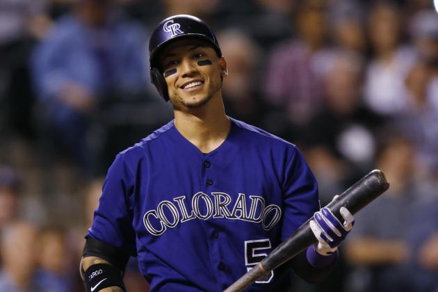

```{r Init, echo=FALSE, message=FALSE, warning=FALSE}
library(tidyverse)
library(lubridate)
library(Lahman)
library(XML)
library(RCurl)
library(rlist)
library(knitr)
library(grid)

opts_chunk$set(echo=FALSE,
               cache=TRUE, autodep=TRUE, cache.comments=FALSE,
               message=FALSE, warning=FALSE)

source("../Baseball/Baseball_Functions.r")
```
```{r , fig.height=4.0}

```

Carlos Gonzalez is the highest paid Rockies player this year.  His salary and bonus compensation is $20,478,571.


> "I'd play for half my salary if I could hit in this dump [Wrigley Field] all the time." -- Babe Ruth

```{r FirstStats, results='asis'}
theurl <- getURL("http://www.baseball-reference.com/leagues/NL/2017-standings.shtml#expanded_standings_W::none")
tables <- readHTMLTable(theurl)
tables <- list.clean(tables, fun = is.null, recursive = FALSE)
n.rows <- unlist(lapply(tables, function(t) dim(t)[1]))

knitr::kable(tables$standings_W, caption = "NL West Standings")

Current <- getCurrentResults()
knitr::kable(Current, digits = 3,
             caption = paste("Current Rockies Results as of", Sys.Date(), sep = " "))
```


\newpage

## Week #5

I did get some favorable feedback on the W/L Margin charts showing the game-by-game success or failure and comparison to the 2007 season.  We will incorporate that into the **Dashboards** section and continue publishing this information weekly.

On the otherhand, I will discontinue updating the Fielding statistics.  The reason being that I am still looking for an automatic way to refresh the data each week.  There appears to be a glitch in the link to this information at baseball-reference.com.  Until I get that resolved,  I will include it as a special when requested.  Don't worry Cath, Nolan is proving himself to be a consistent defensive player at third base.  

You might have noticed on the first page in addition to the picture and quote of the week, I have included a couple of summary tables showing the progress thus far this season.  If you just look at this first page, you should get a sense of the Rockies are doing.

The featured Graphics and Tables this week will address the MLB team payrolls and their steep increases over the last ten years.  Additionally, there is a breakdown of the Rockies salary budget. 

Here is a synopsis of what is included this week.

* **Featured Graphics**  
    + MLB Team Payrolls
    + Rockies Payroll Detail
* Colorado Rockies Dashboards
    + Rockies Win/Loss Graphs for 2017 and 2007
    + National and American League Standings
    + Game-by-Game Results of the past week.
    + **Pythagorean Theorem** prediction of the number of wins.
    + Batting Statistics
    + Pitching Statistics

Most of the source data for this article can be found at URL [http://baseball-reference.com](http://baseball-reference.com).

Let me know what other special interest statistics you might like to see.  Remember to refer to the Glossaries at the end of the document if unfamiliar with one or more of the statistic abbreviations in the tables.


\newpage

# Featured Graphics

# MLB Team Payrolls 2017

```{r MLB_Sal_2007}
c.Teams <- getCurrentTeams()
Sal07 <- getSalaries(2007) %>%
  mutate(Pay07 = Total.Payroll, Average = Pay07/Roster) %>%
  filter(Team != "Montreal Expos") %>% select(c(1,2,3,10,11))
for (i in 1:nrow(Sal07)){
  Sal07$Tm[i] <- dplyr::filter(c.Teams, Team == Sal07$Team[i])$Team.Abr
}
Tot07Payroll <- sum(as.double(Sal07$Pay07))
ColPay07 <- filter(Sal07, Tm == "COL")$Pay07
```


```{r MLB_Sal_2017, message=FALSE, warning=FALSE}
Sal17 <- getSalaries(2017) %>%
  mutate(Pay17 = Total.Payroll, Average = Pay17/Roster) %>%
  select(c(1,2,3,10,11)) 
Sal17$Tm <- ""
for (i in 1:nrow(Sal17)){
  Sal17$Tm[i] <- dplyr::filter(c.Teams, Team == Sal17$Team[i])$Team.Abr
}
Tot17Payroll <- sum(as.double(Sal17$Pay17))
ColPay17 <-  filter(Sal17, Tm == "COL")$Pay17

CAGR17 <-  (Tot17Payroll/Tot07Payroll)^(1/10) - 1

```


The total 2007 MLB Payroll was `r sprintf("$%12.2f Billion",Tot07Payroll/1000/1000/1000)`.
The total 2017 MLB Payroll is `r sprintf("$%12.2f Billion",Tot17Payroll/1000/1000/1000)`.

This is a big increase between 2007 this season.  How does one express this increase in terms of the total growth over that time.  One way that investors use is to express the change as a compound annual growth rate.


```{r Combine17_and_07}
S17 <- select(Sal17, -c(1,2,3,5))
S17 <- rename(S17,Payroll = Pay17)
S07 <- select(Sal07, -c(1,2,3,5))
S07 <- rename(S07,Payroll = Pay07)
S17$Year <- 2017
S07$Year <- 2007

S.Both <- rbind(S17,S07)
S.Both[3] <- lapply(S.Both[3], factor)

ggplot(S.Both, aes(x = reorder(Tm, -Payroll), y = Payroll, fill = Year, or)) + 
  scale_fill_brewer(palette = "Set2", direction = 1) +
  geom_bar(position = "dodge", colour = "black",stat = "identity") +   
  xlab("Team") + 
  ylab("MLB Payroll") +
  theme(axis.text.x = element_text(angle = 90, hjust = 1)) +
  scale_y_continuous("MLB Team Payrolls", 
      breaks = c(0.0, 5.0e+07, 1.0e+08, 1.5e+08,2.0e+08, 2.5e+08),
      labels = c("0", "$50M", "$100M", "$150M", "$200M", "$250M"))

```

Colorado ranks 16th out of 30 with a total payroll of `r sprintf("$%6.2f Million",ColPay17/1000/1000)` this season (2017).  The Rockies payroll in 2007 was `r sprintf("$%6.2f Million",ColPay07/1000/1000)`.  This represents a CAGR of `r sprintf("%6.2f percent",((ColPay17/ColPay07)^(1/10) - 1) * 100)`. This outpaces the MLB as a whole but how does it compare to the rest of the league?

\newpage

**Compound annual growth rate**(CAGR) is a measure of growth applied to investment and funding matters.  Note to all of you who consider yourselves formula-phobes, this is a very useful formula.  You can apply this to your investments, your fantasy baseball winnings and other money, time-sensitive investments.  The formula for CAGR is:


$$CAGR = \left(\frac{End Value}{Beginning Value}\right)^\frac{1}{Years} - 1$$

```{r CAGR_Table}
# Build a table of Team, Payroll-2007, Payroll-2017 and CAGR
c.Teams <- getCurrentTeams()

CAGR <- tibble(Team = Sal17$Team, Tm = Sal17$Tm, Pay17 = Sal17$Pay17, Pay07 = 0 )
for (i in 1:nrow(CAGR)) {
  CAGR$League[i] <- dplyr::filter(c.Teams, Team.Abr == CAGR$Tm[i])$League
  
  CAGR$Division[i] <- dplyr::filter(c.Teams, Team.Abr == CAGR$Tm[i])$Division
  CAGR$LgDiv[i] <- paste(CAGR$League[i], CAGR$Division[i], sep = " ")
}
for (i in 1:nrow(Sal07)){
  CAGR$Pay07[i] <- filter(Sal07, Sal17$Tm[i] == Sal07$Tm)$Pay07
}

CAGR$CAGR <- ((CAGR$Pay17/CAGR$Pay07)^(1/10) - 1) * 100
AvgCAGR <-  mean(CAGR$CAGR)
ggplot(CAGR, aes(x = reorder(Tm, CAGR), y = CAGR, fill = LgDiv)) + 
  geom_bar(stat = "identity") + 
  scale_fill_brewer(palette = "Set2", direction = 1) + 
  xlab("Team") + 
  ylab("Team CAGR") +
  theme(axis.text.x = element_text(angle = 90, hjust = 1)) +
  geom_hline(aes(yintercept=AvgCAGR), color = "#AA0000") +
  labs(x = "Team", title = "MLB Payroll Compound Annual Growth Rate (2007 - 2017)")

```

The average team CAGR for payroll between 2007 and 2017 is `r sprintf("%6.2f percent",AvgCAGR)`.  The graph above shows that the Kansas City Royals, San Francisco Giants and the Washington Nationals have made the largest investment in payrolls over the past decade.  Of late, it appears the Nationals are getting real returns in their number of wins thus far this season.

\newpage

# MLB Payrolls for 2017

```{r SalaryGraph, echo=FALSE, message=FALSE, warning=FALSE}

c.Teams <- getCurrentTeams()

Sal17$Tm = "" ; Sal17$LgDiv <- ""; Sal17$League <-  "" ; Sal17$Division <-  ""
for (i in 1:nrow(Sal17)) {
  Sal17$League[i] <- dplyr::filter(c.Teams, Team == Sal17$Team[i])$League
  Sal17$Tm[i] <- dplyr::filter(c.Teams, Team == Sal17$Team[i])$Team.Abr

  Sal17$Division[i] <- dplyr::filter(c.Teams, Team == Sal17$Team[i])$Division
  Sal17$LgDiv[i] <- paste(Sal17$League[i], Sal17$Division[i], sep = " ")
}
SalG <- Sal17 %>%
  arrange(.,LgDiv, Pay17)
AvgPayRoll <- mean(SalG$Pay17)
Tot17Payroll <- sum(as.double(SalG$Pay17))

ggplot(SalG, aes(x = reorder(Tm, Pay17), y = Pay17, fill = LgDiv)) + 
  geom_bar(stat = "identity") + 
  scale_fill_brewer(palette = "Set2", direction = 1) + 
  xlab("Team") + 
  ylab("MLB Payroll for 2017") +
  theme(axis.text.x = element_text(angle = 90, hjust = 1)) +
  scale_y_continuous("Team Payroll",
      breaks = c(0.0, 5e+07, 1e+08, 1.5e+08, 2.0e+08, 2.5e+08),
      labels = c("0", "$50M", "$100M", "$150M", "$200M", "$250M")) +
  geom_hline(aes(yintercept=AvgPayRoll), color = "#AA0000") +
  labs(x = "Team", title = "MLB Team Payrolls for 2017")

 
```

In terms of overall investment in payroll, the Los Angeles Dodgers, Boston Red Sox and the New York Yankees are the top three. 

\newpage

## Rockies Payroll Detail 2017

### Player Salaries

```{r SalTable, results = 'asis'}
 
colTypes <- "ccccicciiciid"             
Sal2017 <- read_csv("Rockies-2017-Salaries.csv",col_types = colTypes)
S <- Sal2017 %>% select(c(2,3,5,6,8,9, 11,12)) %>% arrange(Player.Last)

col_names <- c("First","Last", "Age", "Pos", "Base ($)", "Bonus ($)", "Total ($)", "Adjusted ($)")
options(knitr.kable.NA = '')
knitr::kable(S, col.names = col_names, 
             format.args = list(decimal.mark = ".", big.mark = ","),
             caption = "Rockies 2017 Player Salary Details")
```

\newpage

```{r RockiesPayroll17, echo=F, message=F, warning=F, fig.width = 6.5}

Sal2017 <- Sal2017 %>% arrange(Total.Salary)

ggplot(Sal2017, aes(x = reorder(Player.Last, -Total.Salary), Total.Salary, fill = Pos)) +
  geom_bar(stat = "identity") +
  scale_y_continuous("Player Salary", 
      breaks = c(0.0, 1e+06, 5.0e+06, 1.0e+07,1.5e+07, 2.0e+07),
      labels = c("0", "$1M", "$5M", "$10M", "$15M", "$20M")) +
  theme(axis.text.x=element_text(angle=90, hjust =1)) +
  labs(x = "Player", title = "Rockies 2017 Player Salaries")


```

The striking feature of the graph above is the three-tier nature of the salary structure.  New players receive, what would be considered a very lucrative salary of more than $500,000 per year.  The next tier consists of about 12 players making between $1M and $7M per year. Then there are the very-highly paid superstars, Arenado at $11,750,000 and Carlos Gonzalez brings in a whopping $20,428,571!  If we look deeper into this, we would find the economic reasonong that drive teams to this stratified pay structure.  Not least of the factors is salary arbitration.  A player is eligible in particular situations for arbitration.  The minimum salary for a MLB player in 2017 is set by MLB and is $535,000 per year.

\newpage

# Rockies Dashboard
## Win Loss Margin

One of the many ways to visualize a teams performance is to show wins and losses as the margin of the win (positive) or loss (negative).  In the graphs below, we show the current season performance.  For emphasis, wins are displayed as green (above the zero) and losses as red (below).

Following the current season's graph, I have included the Win/Loss margin chart for our benchmark season of 2007 when the Rockies won the National League pennant.  

```{r GBG17}
GBG17 <- suppressWarnings(getRockiesGBG(2017))
```

```{r WinLossMargin17,fig.height=3.5,fig.width=6.5}

# Produce Win/Loss Margin Plot

GBG17$Date <- trimws(GBG17$Date)
D <- tibble(Date = GBG17$Date, Year = 2017, WLMargin = GBG17$R - GBG17$RA, 
            DN = GBG17$`D/N`, HA = GBG17$`H/A`, WLsign = " ")
D <- D %>% separate(Date, into = c("Month", "Day"), sep =" ")
D[which(D$WLMargin == 0),]$WLMargin <- 0
D$WLsign <-  ifelse(D$WLMargin < 0, "Loss", "Win")


D$Month <- match(tolower(D$Month), tolower(month.abb))
D$Date <- with(D, as.Date(paste(Year, Month, Day, sep = "/")))

p1 <- ggplot(D, aes(x = Date, y = WLMargin, fill = WLsign)) + 
  geom_bar(stat = "identity", position = position_dodge(width=0.8)) + 
  guides(fill=FALSE) +
  scale_fill_manual(values= c("Win" = "green3", "Loss" = "red")) +
  scale_x_date(date_breaks = "1 month", date_minor_breaks = "1 week", date_labels = "%B") +
  ggtitle("Rockies 2017 Win/Loss Margin") + xlab("Game Date") + ylab("Game Margin (runs)")

```


```{r GBG07}
GBG07 <- suppressWarnings(getRockiesGBG(2007))
```

```{r WinLossMargin07,fig.height=3.5, fig.width=6.5}

# Produce Win/Loss Margin Plot

GBG07$Date <- trimws(GBG07$Date)
D <- tibble(Date = GBG07$Date, Year = 2007, WLMargin = GBG07$R - GBG07$RA, 
            DN = GBG07$`D/N`, HA = GBG07$`H/A`)
D <- D %>% separate(Date, into = c("Month", "Day"), sep =" ")
D$WLsign = ifelse(D$WLMargin < 0, "Loss", "Win")

D$Month <- match(tolower(D$Month), tolower(month.abb))
D$Date <- with(D, as.Date(paste(Year, Month, Day, sep = "/")))

p2 <- ggplot(D, aes(x = Date, y = WLMargin, fill = WLsign)) + 
  geom_bar(stat = "identity", position = position_dodge(width=0.8)) + 
  guides(fill=FALSE) +
  scale_fill_manual(values= c("Win" = "green3", "Loss" = "red")) +
  scale_x_date(date_breaks = "1 month", date_minor_breaks = "1 week", date_labels = "%B") +
  ggtitle("Rockies 2007 Win/Loss Margin") + xlab("Game Date") + ylab("Game Margin (runs)")

# p1 <- ggplot_gtable(ggplot_build(p1))
# p2 <- ggplot_gtable(ggplot_build(p2))
# maxWidth <- unit.pmax(p1$widths[2:3], p2$widths[2:3])
# p1$widths[2:3] <-  maxWidth
# p2$widths[2:3] <-  maxWidth
# 
# grid.arrange(p1,p2, heights = c(6,5))

p1
p2

```

\newpage


## [National League Standings](http://www.baseball-reference.com/leagues/NL/2017-standings.shtml#expanded_standings_W::none)


```{r NLStandings2, results='asis'}
theurl <- getURL("http://www.baseball-reference.com/leagues/NL/2017-standings.shtml#expanded_standings_W::none")
tables <- readHTMLTable(theurl)
tables <- list.clean(tables, fun = is.null, recursive = FALSE)
n.rows <- unlist(lapply(tables, function(t) dim(t)[1]))
knitr::kable(tables$standings_E, caption = "NL East Standings")
knitr::kable(tables$standings_C, caption = "NL Central Standings")
knitr::kable(tables$standings_W, caption = "NL West Standings")

```

\newpage

## [American League Standings](http://www.baseball-reference.com/leagues/AL/2017-standings.shtml#expanded_standings_W::none)

```{r ALStandings, results = 'asis'}

ALurl <- getURL("http://www.baseball-reference.com/leagues/AL/2017-standings.shtml#expanded_standings_W::none")
ALStandings <- readHTMLTable(ALurl)
ALStandings <- list.clean(ALStandings, fun = is.null, recursive = FALSE)
n.rows <- unlist(lapply(ALStandings, function(t) dim(t)[1]))
knitr::kable(ALStandings$standings_E, caption = "AL East Standings")
knitr::kable(ALStandings$standings_C, caption = "AL Central Standings")
knitr::kable(ALStandings$standings_W, caption = "AL West Standings")
```

\newpage

## Rockies Game-by-Game Schedule/Results

```{r GBGResults, results = 'asis'}
GBG17 <- getRockiesGBG(2017) 
GBG17 <- filter(GBG17, Win != " ")
knitr::kable(GBG17)
```
```{r Season17}
WINS <- length(grep("W",GBG17$`W/L`))
LOSSES <- length(grep("L",GBG17$`W/L`))
WPCT <- WINS/(WINS + LOSSES)
TotalR <- sum(as.integer(GBG17$R))
TotalRA <- sum(as.integer(GBG17$RA))
```

The Rockies current record is `r WINS` Wins and `r LOSSES` Losses.  So far, the Rockies have scored `r TotalR` runs and have had `r TotalRA` runs scored against them.

## Pythagorean Win-Loss Theorem
$$ predicted W\% = \frac{R^k}{R^k+RA^k}   $$
```{r PredWin, echo=FALSE, message=FALSE, warning=FALSE, results='asis'}
# Build Table of Pythagorean Win Predictions for 2017
PredictedWins <- tibble(
  `Wins (k=1.81)` = round(TotalR^1.81/(TotalR^1.81+TotalRA^1.81)*162),
  `Wins (k=1.83)` = round(TotalR^1.83/(TotalR^1.83+TotalRA^1.83)*162),
  `Wins (k=2.00)` = round(TotalR^2.00/(TotalR^2.00+TotalRA^2.00)*162))
```

Using the commonly used values of k, the Rockies predicted wins for the 2017 are shown in the table below.  Remember this statistic will vary widely over the course of the season.

```{r PredWins, echo=FALSE, message=FALSE, warning=FALSE, results='asis'}
knitr::kable(PredictedWins, caption = "Predicted Wins for Entire 2017 Season")
```

\newpage

## 2017 Colorado Rockies Batting Statistics (non-pitchers)


```{r, echo=FALSE, message=FALSE, warning=FALSE, results= 'asis'}

burl <- 
  getURL("http://www.baseball-reference.com/teams/COL/2017.shtml#team_batting::none")

  TeamStats <- readHTMLTable(burl)
  TeamStats <- list.clean(TeamStats, fun = is.null, recursive = FALSE)
  TeamBatting <- as_tibble(TeamStats$team_batting) %>%
       separate(Name, into = c("First", "Name"), sep =" ")
TEAMB <- TeamBatting %>% 
  select(c(1,2,4,5,6,8,9,10,11,12,13, 14, 15, 16, 17)) %>%   
  filter(Rk != "Rk" & Pos != "P")
knitr::kable(TEAMB, caption = "Rockies Batting Statistics (1 of 2).")

TEAMB <- TeamBatting %>% 
  select(c(1,2,4,5,18,19,20,21,22,23:29)) %>%   
  filter(Rk != "Rk" & Pos != "P")
knitr::kable(TEAMB, caption = "Rockies Batting Statistics (2 of 2).")
```

* \* - bats left-handed, # - bats both, else - bats right, ? - unknown; OPS_lg for OPS+ does not include pitchers.

\newpage

## Rockies Pitching

```{r, echo=FALSE, message=FALSE, warning=FALSE, results='asis'}

PitchUrl <- 
  getURL("http://www.baseball-reference.com/teams/COL/2017.shtml#team_pitching::none")

  PitchStats <- readHTMLTable(PitchUrl)
  PitchStats <- list.clean(PitchStats, fun = is.null, recursive = FALSE)
  TeamPitching <- as_tibble(TeamStats$team_pitching) %>%
       separate(Name, into = c("First", "Name"), sep =" ")

  TEAMP <- TeamPitching %>%   
  filter(Rk != "Rk") %>%
  select(c(1,2, 4, 5:18))
knitr::kable(TEAMP, caption = "Rockies pitching statistics (1 of 2).")

TEAMP <- TeamPitching %>%
  filter(Rk != "Rk")  %>%
  select(c(1,2, 4, 19:30))
knitr::kable(TEAMP, caption = "Rockies pitching statistics (2 of 2).")

```

  \* - throws left-handed

\newpage


# Topics for Future Articles

Here are a few suggestions, but I would prefer to hear from you, dear reader, on what interests you.

* Player Value - I am personally just getting familiar with this concept.  Work In Progress (WIP)
* What is the OPS+ statistic and how is it calculated.
* Survey MLB ticket prices.

Let me know what you would like to see in future articles.  Send me email at jdreed@q.com.

Yours truly,

  Jim Reed

\newpage

# Appendix


## Glossary

### Batting Statistics

| Statistic Abbreviation| Definition                          |
|-----------------------|--------------------------------------|
|*G*| number of games (participated)|
|*PA*| plate appearances |
|*AB*| at bats|
|*R*|  runs scored by player or team|
|*RA*| runs allowed |
|*H*|  hits|
|*2B*| doubles|
|*3B*| triples|
|*HR*| home runs|
|*RBI*| runs batted in|
|*BA*| batting average|
|*OBP*| on-base percentage|
|*SLG*| slugging percentage|
|*OPS*| on-base percentage plus slugging percentage|
|*OPS+*| This statistic normalizes a player's OPS.  It adjusts for small variables that might affect OPS scores (e.g., park effects). |

\newpage

### Pitching Statistics

| Pitching Statistic    | Definition                          |
|-----------------------|--------------------------------------|
|*Rk*|  Rank This is a count of the rows from top to bottom.  It is recalculated following the sorting of a column. |
|*Pos*|  Position |
|*Name*|  Player Name |
|*Age*|  Player’s age at midnight of June 30th of that year |
|*W*|  Wins |
|*L*|  Losses |
|*W-L%*|  Win-Loss Percentage W / (W + L) For players, leaders need one decision for every ten team games.  For managers, minimum to qualify for leading is 320 games. |
|*ERA*|  9 * ER / IP  |
|*G*|  Games Played or Pitched |
|*GS*|  Games Started |
|*GF*|  Games Finished |
|*CG*|  Complete Game |
|*SHO*|  Shutouts No runs allowed and a complete game. |
|*SV*|  Saves |
|*IP*|  Innings Pitched |
|*H*|  Hits/Hits Allowed |
|*R*|  Runs Scored/Allowed |
|*ER*|  Earned Runs Allowed |
|*HR*|  Home Runs Hit/Allowed |
|*BB*|  Bases on Balls/Walks |
|*IBB*|  Intentional Bases on Balls First tracked in 1955. |
|*SO*|  Strikeouts |
|*HBP*|  Times Hit by a Pitch. |
|*BK*|  Balks |
|*WP*|  Wild Pitches |
|*BF*|  Batters Faced 
|*ERA+*|  ERA+ 100*[lgERA/ERA] Adjusted to the player’s ballpark(s). |
|*FIP*|  Fielding Independent Pitching |
|*WHIP*|  (BB + H)/IP  For recent years, leaders need 1 IP per team game played |
|*H9*|  9 x H / IP For recent years, leaders need 1 IP per team game played |
|*HR9*|  9 x HR / IP For recent years, leaders need 1 IP per team game played |
|*BB9*|  9 x BB / IP For recent years, leaders need 1 IP per team game played |
|*SO9*|  9 x SO / IP For recent years, leaders need 1 IP per team game played |
|*SO/W*|  SO/W or SO/BB For recent years, pitching leaders need 1 IP per team game played. |

\newpage

### Fielding Statistics

| Fielding Statistic    | Definition                          |
|-----------------------|--------------------------------------|
|*Name*| Player Name Bold can mean player is active for this team or player has appeared in MLB * means LHP or LHB, \\# means switch hitter, + can mean HOFer. |
|*Age*| Player’s age at midnight of June 30th of that year |
|*G*| Games Played or Pitched |
|*GS*| -- Games Started |
|*CG*| -- Complete Game |
|*Inn*| -- Innings Played in Field |
|*Ch*| -- Defensive Chances Putouts + Assists + Errors |
|*PO*| -- Putouts |
|*A*| -- Assists  |
|*E*| -- Errors Committed |
|*DP*| -- Double Plays Turned |
|*Fld%*| -- Fielding Percentage (Putouts + Assists) / (Putouts + Assists + Errors) 
|*Rtot*| -- Total Zone Total Fielding Runs Above Avg The number of runs above or below average the player was worth based on the number of plays made. This number combines the Rtz, Rdp,Rof, Rcatch numbers into a total defensive contribution.  See the glossary section for a more complete explanation.  Provided by BaseballProjection.com |
|*Rtot/yr*| -- Total Zone Total Fielding Runs Above Avg per 1,200 Inn  The number of runs above or below average the fielder was worth per 1,200 Innings (approx 135 games). This number combines the Rtz, Rdp, Rof, Rcatch numbers into a total defensive contribution.  See the glossary section for a more complete explanation.  Provided by BaseballProjection.com |
|*Rdrs*| -- BIS Defensive Runs Saved Above Avg  The number of runs above or below average the player was worth based on the number of plays made.  This number combines the Rpm, Rbdp, Rbof, Rbcatch numbers into a total defensive contribution.  Provided by Baseball Info Solutions |
|*Rdrs/yr*| -- BIS Defensive Runs Saved Above Avg per 1,200 Inn The number of runs above or below average the fielder was worth per 1,200 Innings (approx 135 games).  This number combines the Rpm, Rbdp, Rbof, Rbcatch numbers into a total defensive contribution. For pitchers, this is set to 200 Innings.  Provided by Baseball Info Solutions |
|*RF/9*| -- Range Factor per 9 Inn 9 * (Putouts + Assists) / Innings Played |
|*RF/G*| -- Range Factor per Game (Putouts + Assists) / Games Played  |
|*PB*| -- Passed Balls |
|*WP*| -- Wild Pitches |
|*SB*| -- Stolen Bases |
|*CS*| -- Caught Stealing |
|*CS%*| -- Caught Stealing Percentage CS / (SB + CS) |
|*lgCS%*| -- League Caught Stealing Percentage League Expected CS / Players SB + Players CS |
|*PO*| -- Pickoffs Runner picked off a base. May include cases they were safe on an error. Also includes Pickoff Caught Stealing plays.|
|*Pos*| Summary -- Positions Played  The positions either followed by the games played at that position or in order of games or innings played.  For a single season, * indicates they played at least 2/3rds of the team games there Positions after / indicate less than ten games played at those positions.  For career, a + sign means more than 300 games at that position and a - sign means less than 30 games. |


Run date time: `r Sys.time()`
