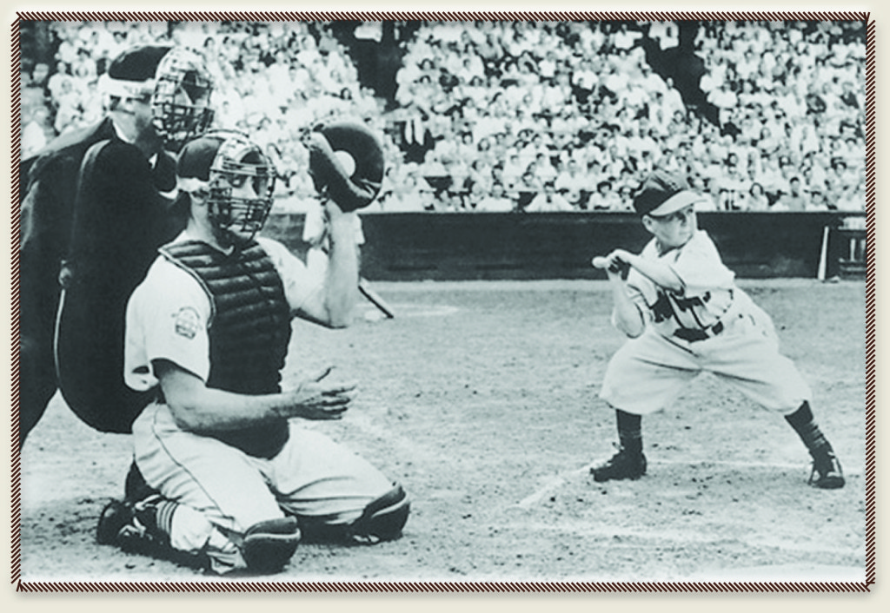

```{r Init, echo=FALSE, message=FALSE, warning=FALSE}
library(tidyverse)
library(readxl)
library(lubridate)
library(Lahman)
library(XML)
library(RCurl)
library(rlist)
library(knitr)
library(grid)
library(xtable)

opts_chunk$set(echo=FALSE,
               cache=TRUE, autodep=TRUE, cache.comments=FALSE,
               message=FALSE, warning=FALSE)

source("../Baseball/Baseball_Functions.r")
```
```{r Headline,fig.cap = "August 21st, North America will experience a full eclipse of the Sun."}

```

> Slump? I ain’t in no slump… I just ain’t hitting. -- Yogi Berra (1925-2015)

```{r FirstStats, results='asis'}
#theurl <- getURL("http://www.baseball-reference.com/leagues/NL/2017-standings.shtml#ex#panded_standings_W::none")
theurl <- getURL("https://www.baseball-reference.com/leagues/NL/2017-standings.shtml#expanded_standings_C::none")
tables <- readHTMLTable(theurl)
tables <- list.clean(tables, fun = is.null, recursive = FALSE)
n.rows <- unlist(lapply(tables, function(t) dim(t)[1]))

knitr::kable(tables$standings_W, caption = "NL West Standings")

Current <- getCurrentResults()
knitr::kable(Current, digits = 3,
             caption = paste("Current Rockies Results as of", Sys.Date(), sep = " "))
```

```{r Season17, message=FALSE, warning=FALSE, include=FALSE}
WINS <- Current$Wins
LOSSES <- Current$Losses
WPCT <- Current$Win.Pct
TotalR <- Current$Runs
TotalRA <- Current$Runs.Ag

```

\newpage

```{r ,fig.height= 2.0}
knitr::include_graphics("images/Colorado-Rockies-Logo2.jpg")
```


## Week #20

The Rockies won three of seven this past week, winning two of four against Atlanta Braves and one of three against the Milwaukee Brewers.   Still hanging onto second place in the NL West, the Rockies will need more wins in the  thirty-nine remaining games.  Twenty more wins would put the Rox right on track for the Pythagorean estimate for winning eighty-eight games.

We continue to build on the WAR and top twenty players (pitchers and position).  Adding some famous favorites of some of you readers, as well as an interesting sidebar from 1951, Mr. Eddie Gaedel.  Read on for the "rest of the story."

If you would like to see an in-depth explanation and the history of WAR, see the following URL: 

>https://www.baseball-reference.com/about/war_explained.shtml.

* **Featured Article**  
    + Top Twenty MLB Pitchers of All Time and Others
    + Top Twenty MLB Position Players of All Time and Others
* Colorado Rockies Dashboard
    + Rockies Win/Loss Graphs for 2017 and 2007
    + Top Twelve Rockies Players as Measured by WAR
    + National and American League Standings
    + Game-by-Game Results
    + **Pythagorean Theorem** prediction of the number of wins.
    + Batting Statistics (for non-pitchers)
    + Pitching Statistics
    + National League Team Standard Batting
    + Current Injuries **Updated**
* Topics for Future Articles
* Glossary
    + Batting Statistics
    + Pitching Statistics
    + Fielding Statistics

Most of the source data for this article can be found at URL [http://baseball-reference.com](http://baseball-reference.com).

Let me know what other special interest statistics you might like to see.  Remember to refer to the Glossaries at the end of the document if unfamiliar with one or more of the statistic abbreviations in the tables.

\newpage

# Featured Article
## Top Twenty MLB Pitchers of All Time 

The tables below show the top pitchers of all time.  As before, these WAR values are from Baseball-Reference.com.

```{r TopPitchers}
if(!exists("pitWar")) {pitWar <- getDailyPitWar()}

pitTop20 <- pitWar %>% arrange(mlb_ID,year_ID) %>% 
  group_by(mlb_ID, name_common) %>% 
  summarize(Start  = min(year_ID), 
            End    = max(year_ID),
            Years  = End - Start + 1,
            Games  = sum(G), 
            IPouts = sum(IPouts), 
            WAR    = sum(WAR)) %>%
  arrange(desc(WAR)) %>% 
  head(n = 20)
  pitTop20$Rank <- 1:20
  
  colNames <- c( "Rank","Player","Career Start", "Career End","Years", 
                 "Games", "IPouts", "WAR")
  knitr::kable(pitTop20[,c(9,2:8)], col.names = colNames, 
               #format.args = list(big.mark = ','),
               cap = "All-Time Best Pitchers (WAR)",
               align = c("c", "l", "c", "c", "c", "r", "r", "r"))
```
```{r OtherInit}
otherGreats<- tibble(
             Name = c("Roberto Clemente", "Rod Carew",                     #1  
                "Bob Gibson",     "Dave Winfield",    "Harmon Killebrew",  #2
                "Whitey Ford",    "Johnny Bench",     "Tony Gwynn",        #3
                "Reggie Jackson", "Brooks Robinson",  "Ernie Banks",       #4
                "Rich Gossage",  "Eddie Gaedel",     "Boog Powell",       #5
                "Sandy Koufax",   "Pete Rose",        "Jackie Robinson",   #6
                "Derek Jeter",    "Yogi Berra",     "Joe DiMaggio",      #7
                "Cal Ripken",     "Roger Maris",      "Bob Feller",        #8
                "Clayton Kershaw","Curt Schilling",   "Don Sutton",        #9
                "Jim Palmer"), 
             Type = c("B", "B",       #1
                     "P","B","B",     #2
                     "P","B","B",     #3 
                     "B","B","B",     #4
                     "P","B","B",     #5
                     "P","B","B",     #6
                     "B","B","B",     #7 
                     "B","B","P",     #8
                     "P","P","P","P"))    #9
```

\newpage

## Other Great MLB Pitchers (WAR)

Several notable pitchers in this selection, including Rich "Goose" Gossage, who was born in Colorado Springs, Colorado on July 5, 1951.  In his prime, Gossage could throw fastballs in the range of 95-102 mph with pinpoint accuracy.  

Only one pitcher is currently active, Clayton Kershaw.  He is in his tenth season and already achieved a WAR value of 57.26. Assuming Kershaw has a long career, he is on track to enter the list of top ten pitchers after twenty years.

```{r OtherPitchers}
if(!exists("pitWar")) {pitWar <- getDailyPitWar()}

pitAll <- pitWar %>% arrange(mlb_ID,year_ID) %>% 
  group_by(mlb_ID, name_common) %>% 
  summarize(Start   = min(year_ID), 
            End     = max(year_ID),
            Years   = End - Start + 1,
            Games   = sum(G), 
            IPouts  = sum(IPouts),
            WAR     = sum(WAR)) %>%
  arrange(desc(WAR))
  
  pitAll$Rank <- 1:nrow(pitAll)

# Let's process the Pitchers.
## Initiate Empty results tibble.
pitResults <- tibble( mlb_ID=integer(), name_common = character(),           
                      Start=integer(), End=integer(),  Years = integer(),
                      Games=integer(), IPouts=integer(),    WAR=double(), 
                      Rank=integer())

pitchers <- filter(otherGreats, Type == "P")
for (i in 1:nrow(pitchers)) {
  rec <- filter(pitAll,name_common == pitchers$Name[i])
  if (nrow(rec) > 1) { rec <- rec[1,]}
  if(nrow(rec) == 0) {print(paste("Error.", pitchers$Name[i]))}
  #print(rec)
  pitResults[i,] <- rec
}

pitResults <- arrange(pitResults, Rank)

colNames <- c( "Rank","Player","Career Start", "Career End","Years",
                 "Games", "IPouts", "WAR")
knitr::kable(pitResults[,c(9,2:8)], col.names = colNames,
               cap = "Other Great Pitchers (WAR)",
               align = c("c", "l", "c", "c", "c", "r", "r", "r"))

```

\newpage


## Top Twenty MLB Position Players of All Time

The following table lists the top twenty position players of all time. There aren't any past or present Rockies on the list yet, but maybe someday!


```{r TopPosition}

if(!exists("batWar")) {batWar <- getDailyBatWar()}

# Tables built in previous R block.
batTop20 <- batWar %>% arrange(mlb_ID,year_ID) %>% 
  group_by(mlb_ID, name_common) %>% 
  summarize(Start   = min(year_ID), 
            End     = max(year_ID),
            Years   = End - Start + 1,
            Games   = sum(G), 
            PA      = sum(PA),
            WAR     = sum(WAR)) %>%
  arrange(desc(WAR)) %>% 
  head(n = 20)
  batTop20$Rank <- 1:20
# Correction for Ted Williams years of playing.  He served in the military
# for the years 1943-45.
batTop20$Years[11] <- 19
  
colNames <- c( "Rank","Player","Career Start", "Career End","Years", 
                 "Games", "PA", "WAR")
knitr::kable(batTop20[,c(9,2:8)], col.names = colNames,
               cap = "All-Time Best Position Players (WAR)",
               align = c("c", "l", "c", "c", "c", "r", "r", "r"))
  

```

\newpage

## Other Great MLB Position Players (WAR)

The position players shown here are a combination of some the reader's requested and those of yours truly.  You probably recognize most these names.  The exception for most will be **Eddie Gaedel**. Eddie had exactly one plate appearance at which he walked on four straight balls.  At the time, Eddie was 26 years old and stood 3 feet, 7 inches.  **Bill Veeck** was searching for ways to boost lagging attendance for the St. Louis Browns.  Bill signed Eddie to a year contract and outfitted him with a uniform belonging to the nine-year old bat boy.  Gaedel was given the number **1/8**. Eddie being something of a showman himself, participated willingly in the publicity stunt.  Upon receiving the fourth ball, Eddie proceeded to first base, bowing twice to the crowd along the way.

Days later, Eddie Gaedel's contract was voided by American League President, Will Harridge.

```{r EddieGaedel,fig.cap = "August 19, 1951, Eddie Gaedel batting for the St. Louis Browns.  This would be his one and only plate appearance."}


```

\newpage

```{r OtherPosition}
if(!exists("batWar")) {batWar <- getDailyBatWar()}

batAll <- batWar %>% arrange(mlb_ID,year_ID) %>% 
  group_by(mlb_ID, name_common) %>% 
  summarize(Start   = min(year_ID), 
            End     = max(year_ID),
            Years   = End - Start + 1,
            Games   = sum(G), 
            PA      = sum(PA),
            WAR     = sum(WAR)) %>%
  arrange(desc(WAR))
  
  batAll$Rank <- 1:nrow(batAll)

# Now, process the position players.
## Initiate Empty results tibble.
batResults <- tibble( mlb_ID=integer(), name_common=character(),
                      Start=integer(), End=integer(), Years=integer(), 
                      Games=integer(),PA=integer(), WAR=double(), 
                      Rank=integer()   )

position.players <- filter(otherGreats, Type == "B")
for (i in 1:nrow(position.players)) {
  rec <- filter(batAll,name_common == position.players$Name[i])
  if (nrow(rec) > 1) { rec <- rec[1,]}
  if(nrow(rec) == 0) {print(paste("Error.", position.players$Name[i]))}
  #print(rec)
  batResults[i,] <- rec
  
}

batResults <- arrange(batResults, Rank)


  colNames <- c( "Rank","Player","Career Start", "Career End","Years",
                 "Games", "PA", "WAR")
  knitr::kable(batResults[,c(9,2:8)], col.names = colNames,
               cap = "Other Great Position Players (WAR)",
               align = c("c", "l", "c", "c", "c", "r", "r", "r"))

```

\newpage

# Colorado Rockies Dashboard
## Win Loss Margin

One of the many ways to visualize a teams performance is to show wins and losses as the margin of the win (positive) or loss (negative).  In the graphs below, we show the current season performance.  For emphasis, wins are displayed in green (above the zero) and losses in red (below).

Following the current season's graph, I have included the Win/Loss margin chart for our benchmark season of 2007 when the Rockies won the National League pennant.  

```{r GBG17}
GBG17 <- suppressWarnings(getRockiesGBG(2017))

# Calculate Cumulative Wins and Losses
GBG17 <- GBG17 %>%  
  mutate(WinG = ifelse( grepl('W',GBG17$'W/L'), 1, 0)) %>% 
  mutate(LossG = ifelse(grepl('L',GBG17$'W/L'),1,0))
GBG17 <- GBG17 %>% mutate(C.WinG = cumsum(WinG)) %>%
      mutate(C.LossG = cumsum(LossG)) %>%
      mutate(Date.Full = as.Date(paste(trimws(GBG17$Date), ", 2017", sep =""), 
                                 format ="%B %d, %Y"))
```

```{r WinLossMargin17,fig.height=3.5,fig.width=6.5}

# Produce Win/Loss Margin Plot

GBG17$Date <- trimws(GBG17$Date)
D <- tibble(Date = GBG17$Date, Year = 2017, WLMargin = GBG17$R - GBG17$RA, 
            DN = GBG17$`D/N`, HA = GBG17$`H/A`, WLsign = " ")
D <- D %>% separate(Date, into = c("Month", "Day"), sep =" ")
D[which(D$WLMargin == 0),]$WLMargin <- 0
D$WLsign <-  ifelse(D$WLMargin < 0, "Loss", "Win")


D$Month <- match(tolower(D$Month), tolower(month.abb))
D$Date <- with(D, as.Date(paste(Year, Month, Day, sep = "/")))

p1 <- ggplot(D, aes(x = Date, y = WLMargin, fill = WLsign)) + 
  geom_bar(stat = "identity", position = position_dodge(width=0.8)) + 
  guides(fill=FALSE) +
  scale_fill_manual(values= c("Win" = "green3", "Loss" = "red")) +
  scale_x_date(date_breaks = "1 month", date_minor_breaks = "1 week", date_labels = "%B") +
  ggtitle("Rockies 2017 Win/Loss Margin") + xlab("Game Date") + ylab("Game Margin (runs)")

```


```{r GBG07}
GBG07 <- suppressWarnings(getRockiesGBG(2007))

# Calculate Cumulative Wins and Losses
GBG07 <- GBG07 %>%  
  mutate(WinG = ifelse( grepl('W',GBG07$'W/L'), 1, 0)) %>% 
  mutate(LossG = ifelse(grepl('L',GBG07$'W/L'),1,0))
GBG07 <- GBG07 %>% mutate(C.WinG = cumsum(WinG)) %>%
      mutate(C.LossG = cumsum(LossG)) %>%
      mutate(Date.Full = as.Date(paste(trimws(GBG07$Date), ", 2017", sep =""), 
                                 format ="%B %d, %Y"))
```

```{r WinLossMargin07,fig.height=3.5, fig.width=6.5}

# Produce Win/Loss Margin Plot

GBG07$Date <- trimws(GBG07$Date)
D <- tibble(Date = GBG07$Date, Year = 2007, WLMargin = GBG07$R - GBG07$RA, 
            DN = GBG07$`D/N`, HA = GBG07$`H/A`)
D <- D %>% separate(Date, into = c("Month", "Day"), sep =" ")
D$WLsign = ifelse(D$WLMargin < 0, "Loss", "Win")

D$Month <- match(tolower(D$Month), tolower(month.abb))
D$Date <- with(D, as.Date(paste(Year, Month, Day, sep = "/")))

p2 <- ggplot(D, aes(x = Date, y = WLMargin, fill = WLsign)) + 
  geom_bar(stat = "identity", position = position_dodge(width=0.8)) + 
  guides(fill=FALSE) +
  scale_fill_manual(values= c("Win" = "green3", "Loss" = "red")) +
  scale_x_date(date_breaks = "1 month", date_minor_breaks = "1 week", date_labels = "%B") +
  ggtitle("Rockies 2007 Win/Loss Margin") + xlab("Game Date") + ylab("Game Margin (runs)")

p1
p2
```
\newpage

## Top Twelve Rockies Players as Measured by WAR

Following is a table of the top twelve Colorado Rockies players as measured by the most recent WAR assessment for pitchers and position players.  Week after week Nolan Arenado is at the top of this list.  You may be surprised by some of the others on the list.


```{r Top12Rockies}

defSalary <- 535000  # This will change to 545,000
# Get latest Batting and Pitching WAR Data
if(!exists("batWar")) {batWar <- getDailyBatWar()}
if(!exists("pitWar")) {pitWar <- getDailyPitWar()}

# Add WAR Field to roster
url <- 
  "https://www.baseball-reference.com/teams/COL/2017-roster.shtml#appearances::none"
doc <- getURL(url)
cClasses <- c("character", "integer",   "character", "character", "character",
              "character", "integer",   "character", "integer",   "integer",
              "integer",   "integer",   "integer",   "integer",   "integer",
              "integer",   "integer",   "integer",   "integer",   "integer",
              "integer",   "integer",   "integer",   "integer",   "integer",
              "integer",   "double",   "character",    "character")
tables <- suppressWarnings(readHTMLTable(doc, header = TRUE, 
              stringsAsFactors = FALSE, colClasses = cClasses))

roster <- tables[[2]]
tnames <- names(roster)
tnames[3] <- "Nat"
tnames[29] <- "Note"
colnames(roster) <- tnames
roster <- as_tibble(roster) 

# Cleanup Salary field
roster$Salary <- suppressWarnings(sapply(roster$Salary, 
                    function(xx) as.numeric(gsub('[^0-9]', '', xx))))
roster$Salary[is.na(roster$Salary)] <- defSalary

# Separate top players by WAR
top12 <- head(arrange(roster,desc(WAR)),n = 12) %>% mutate(Salary.M = Salary/1e6)
top12$Rank <- 1:12
knitr::kable(top12[,c(31,1,2,27,30)], cap = "Rockies Top 12 Players (WAR)")

```


\newpage


## [National League Standings](http://www.baseball-reference.com/leagues/NL/2017-standings.shtml#expanded_standings_W::none)


```{r NLStandings2, results='asis'}
theurl <- getURL("https://www.baseball-reference.com/leagues/NL/2017-standings.shtml#expanded_standings_W::none")
tables <- readHTMLTable(theurl)
tables <- list.clean(tables, fun = is.null, recursive = FALSE)
n.rows <- unlist(lapply(tables, function(t) dim(t)[1]))
knitr::kable(tables$standings_E, caption = "NL East Standings")
knitr::kable(tables$standings_C, caption = "NL Central Standings")
knitr::kable(tables$standings_W, caption = "NL West Standings")
```

\newpage

## [American League Standings](http://www.baseball-reference.com/leagues/AL/2017-standings.shtml#expanded_standings_W::none)

```{r ALStandings, results = 'asis'}

ALurl <- getURL("https://www.baseball-reference.com/leagues/AL/2017-standings.shtml#expanded_standings_W::none")
ALStandings <- readHTMLTable(ALurl)
ALStandings <- list.clean(ALStandings, fun = is.null, recursive = FALSE)
n.rows <- unlist(lapply(ALStandings, function(t) dim(t)[1]))
knitr::kable(ALStandings$standings_E, caption = "AL East Standings")
knitr::kable(ALStandings$standings_C, caption = "AL Central Standings")
knitr::kable(ALStandings$standings_W, caption = "AL West Standings")
```

\newpage

## Rockies Game-by-Game Schedule/Results

```{r GBGResults, results = 'asis'}
GBG17 <- getRockiesGBG(2017) 
GBG17 <- filter(GBG17, Win != " ")
knitr::kable(GBG17)
```


The Rockies current record is `r Current$Wins` Wins and `r Current$Losses` Losses.  So far, the Rockies have scored `r TotalR` runs and have had `r TotalRA` runs scored against them.

\newpage

## Pythagorean Win-Loss Theorem
$$ predicted W\% = \frac{R^k}{R^k+RA^k}   $$
```{r PredWin, echo=FALSE, message=FALSE, warning=FALSE, results='asis'}
# Build Table of Pythagorean Win Predictions for 2017
PredictedWins <- tibble(
  `Wins (k=1.81)` = round(TotalR^1.81/(TotalR^1.81+TotalRA^1.81)*162),
  `Wins (k=1.83)` = round(TotalR^1.83/(TotalR^1.83+TotalRA^1.83)*162),
  `Wins (k=2.00)` = round(TotalR^2.00/(TotalR^2.00+TotalRA^2.00)*162))
```

Using the commonly used values of k, the Rockies predicted wins for the 2017 are shown in the table below.  Remember this statistic will vary widely over the course of the season.

```{r PredWins, echo=FALSE, message=FALSE, warning=FALSE, results='asis'}
knitr::kable(PredictedWins, caption = "Predicted Wins for Entire 2017 Season")
```

\newpage

## Batting Statistics (non-pitchers)


```{r, echo=FALSE, message=FALSE, warning=FALSE, results= 'asis'}

burl <- 
  getURL("https://www.baseball-reference.com/teams/COL/2017.shtml#team_batting::none")

  TeamStats <- readHTMLTable(burl)
  TeamStats <- list.clean(TeamStats, fun = is.null, recursive = FALSE)
  TeamBatting <- as_tibble(TeamStats$team_batting) %>%
       separate(Name, into = c("First", "Name"), sep =" ")
TEAMB <- TeamBatting %>% 
  select(c(1,2,4,5,6,8,9,10,11,12,13, 14, 15, 16, 17)) %>%   
  filter(Rk != "Rk" & Pos != "P")
knitr::kable(TEAMB, caption = "Rockies Batting Statistics (1 of 2).")

TEAMB <- TeamBatting %>% 
  select(c(1,2,4,5,18,19,20,21,22,23:29)) %>%   
  filter(Rk != "Rk" & Pos != "P")
knitr::kable(TEAMB, caption = "Rockies Batting Statistics (2 of 2).")
```

* \* - bats left-handed, # - bats both, else - bats right, ? - unknown; OPS_lg for OPS+ does not include pitchers.

\newpage

## Pitching Statistics

```{r, echo=FALSE, message=FALSE, warning=FALSE, results='asis'}

PitchUrl <- 
  getURL("http://www.baseball-reference.com/teams/COL/2017.shtml#team_pitching::none")

  PitchStats <- readHTMLTable(PitchUrl)
  PitchStats <- list.clean(PitchStats, fun = is.null, recursive = FALSE)
  TeamPitching <- as_tibble(TeamStats$team_pitching) %>%
       separate(Name, into = c("First", "Name"), sep =" ")

  TEAMP <- TeamPitching %>%   
  filter(Rk != "Rk") %>%
  select(c(1,2, 4, 5:18))
knitr::kable(TEAMP, caption = "Rockies pitching statistics (1 of 2).")

TEAMP <- TeamPitching %>%
  filter(Rk != "Rk")  %>%
  select(c(1,2, 4, 19:30))
knitr::kable(TEAMP, caption = "Rockies pitching statistics (2 of 2).")

```

  \* - throws left-handed

\newpage

## National League Team Standard Batting

```{r}
NLTeamBatUrl <- 
  getURL("https://www.baseball-reference.com/leagues/NL/2017.shtml#teams_standard_batting::3")

C.Classes <- c("character", "integer", rep("double",2), rep("integer",14), 
               rep("double",3), rep("integer",8))

BatStats <- readHTMLTable(NLTeamBatUrl,stringsAsFactors = FALSE, colClasses = C.Classes)
BatStats <- list.clean(BatStats, fun = is.null, recursive = FALSE)
NLBatStats <- as_tibble(BatStats$teams_standard_batting, as.factor = FALSE)
  
TEAMB <- NLBatStats %>% arrange(desc(NLBatStats$'R/G')) %>%  select(c(1:4, 5:17))
knitr::kable(TEAMB, caption = "NL Team Batting statistics (1 of 2).")

TEAMB <- NLBatStats %>% arrange(desc(NLBatStats$'R/G')) %>%  select(c(1:4, 18:29))
knitr::kable(TEAMB, caption = "NL Team Batting statistics (2 of 2).")


```


\newpage

## Current Injuries

```{r, echo=FALSE, message=FALSE, warning=FALSE, results= 'asis'}
injUrl <- "https://www.baseball-reference.com/teams/COL/2017.shtml#injuries::none"
injDoc <- getURL(injUrl)
Tables <- readHTMLTable(injDoc)
## Temporary Code to Display Injury Report until I figure out how 
## to use the URL provided
## Baseball-Reference.com (above).
  Injuries <- read_excel("./data/Rockies_Injuries.xlsx")
  
  Injuries <- select(Injuries,c(1,3,4,5)) 
  Injuries <-  rename(Injuries, Updated = Last.Updated, 
                      Type = Injury.Type, Details = Injury.Details)
 
#knitr::kable(Injuries, caption = "Rockies Current Injuries",
#      col.names = c("Name", "Updated", "Type", "Details"))
print.xtable(xtable(Injuries, align = "l|l|l|l|p{4in}",caption = "Current Injuries"),
             comment = FALSE)
```


\newpage

# Topics for Future Articles

Here are a few suggestions, but I would prefer to hear from you, dear reader, on what interests you.

* Player Value - There is much more to cover here.  Perhaps we can rank some of the past greats based on their modern day WAR rating?
* What is the OPS+ statistic and how is it calculated.
* Survey MLB ticket prices.
* Are WAR ratings a good indicator of past season's playoff and World Series teams?
* A suggestion from a work colleague that we investigate what budding talent we have in the Rockies farm system.  I will look into this and see what I can find.

Let me know what you would like to see in future articles.  Send me an email at jdreed@q.com.

Yours truly,

  Jim Reed

\newpage

# Appendix


## Glossary

### Batting Statistics

| Statistic Abbreviation| Definition                          |
|-----------------------|--------------------------------------|
|*G*| number of games (participated)|
|*PA*| plate appearances |
|*AB*| at bats|
|*R*|  runs scored by player or team|
|*RA*| runs allowed |
|*H*|  hits|
|*2B*| doubles|
|*3B*| triples|
|*HR*| home runs|
|*RBI*| runs batted in|
|*BA*| batting average|
|*OBP*| on-base percentage|
|*SLG*| slugging percentage|
|*OPS*| on-base percentage plus slugging percentage|
|*OPS+*| This statistic normalizes a player's OPS.  It adjusts for small variables that might affect OPS scores (e.g., park effects). |

\newpage

### Pitching Statistics

| Pitching Statistic    | Definition                          |
|-----------------------|--------------------------------------|
|*Rk*|  Rank This is a count of the rows from top to bottom.  It is recalculated following the sorting of a column. |
|*Pos*|  Position |
|*Name*|  Player Name |
|*Age*|  Player’s age at midnight of June 30th of that year |
|*W*|  Wins |
|*L*|  Losses |
|*W-L%*|  Win-Loss Percentage W / (W + L) For players, leaders need one decision for every ten team games.  For managers, minimum to qualify for leading is 320 games. |
|*ERA*|  9 * ER / IP  |
|*G*|  Games Played or Pitched |
|*GS*|  Games Started |
|*GF*|  Games Finished |
|*CG*|  Complete Game |
|*SHO*|  Shutouts No runs allowed and a complete game. |
|*SV*|  Saves |
|*IP*|  Innings Pitched |
|*H*|  Hits/Hits Allowed |
|*R*|  Runs Scored/Allowed |
|*ER*|  Earned Runs Allowed |
|*HR*|  Home Runs Hit/Allowed |
|*BB*|  Bases on Balls/Walks |
|*IBB*|  Intentional Bases on Balls First tracked in 1955. |
|*SO*|  Strikeouts |
|*HBP*|  Times Hit by a Pitch. |
|*BK*|  Balks |
|*WP*|  Wild Pitches |
|*BF*|  Batters Faced 
|*ERA+*|  ERA+ 100*[lgERA/ERA] Adjusted to the player’s ballpark(s). |
|*FIP*|  Fielding Independent Pitching |
|*WHIP*|  (BB + H)/IP  For recent years, leaders need 1 IP per team game played |
|*H9*|  9 x H / IP For recent years, leaders need 1 IP per team game played |
|*HR9*|  9 x HR / IP For recent years, leaders need 1 IP per team game played |
|*BB9*|  9 x BB / IP For recent years, leaders need 1 IP per team game played |
|*SO9*|  9 x SO / IP For recent years, leaders need 1 IP per team game played |
|*SO/W*|  SO/W or SO/BB For recent years, pitching leaders need 1 IP per team game played. |

\newpage

### Fielding Statistics

| Fielding Statistic    | Definition                          |
|-----------------------|--------------------------------------|
|*Name*| Player Name Bold can mean player is active for this team or player has appeared in MLB * means LHP or LHB, \\# means switch hitter, + can mean HOFer. |
|*Age*| Player’s age at midnight of June 30th of that year |
|*G*| Games Played or Pitched |
|*GS*| -- Games Started |
|*CG*| -- Complete Game |
|*Inn*| -- Innings Played in Field |
|*Ch*| -- Defensive Chances Putouts + Assists + Errors |
|*PO*| -- Putouts |
|*A*| -- Assists  |
|*E*| -- Errors Committed |
|*DP*| -- Double Plays Turned |
|*Fld%*| -- Fielding Percentage (Putouts + Assists) / (Putouts + Assists + Errors) 
|*Rtot*| -- Total Zone Total Fielding Runs Above Avg The number of runs above or below average the player was worth based on the number of plays made. This number combines the Rtz, Rdp,Rof, Rcatch numbers into a total defensive contribution.  See the glossary section for a more complete explanation.  Provided by BaseballProjection.com |
|*Rtot/yr*| -- Total Zone Total Fielding Runs Above Avg per 1,200 Inn  The number of runs above or below average the fielder was worth per 1,200 Innings (approx 135 games). This number combines the Rtz, Rdp, Rof, Rcatch numbers into a total defensive contribution.  See the glossary section for a more complete explanation.  Provided by BaseballProjection.com |
|*Rdrs*| -- BIS Defensive Runs Saved Above Avg  The number of runs above or below average the player was worth based on the number of plays made.  This number combines the Rpm, Rbdp, Rbof, Rbcatch numbers into a total defensive contribution.  Provided by Baseball Info Solutions |
|*Rdrs/yr*| -- BIS Defensive Runs Saved Above Avg per 1,200 Inn The number of runs above or below average the fielder was worth per 1,200 Innings (approx 135 games).  This number combines the Rpm, Rbdp, Rbof, Rbcatch numbers into a total defensive contribution. For pitchers, this is set to 200 Innings.  Provided by Baseball Info Solutions |
|*RF/9*| -- Range Factor per 9 Inn 9 * (Putouts + Assists) / Innings Played |
|*RF/G*| -- Range Factor per Game (Putouts + Assists) / Games Played  |
|*PB*| -- Passed Balls |
|*WP*| -- Wild Pitches |
|*SB*| -- Stolen Bases |
|*CS*| -- Caught Stealing |
|*CS%*| -- Caught Stealing Percentage CS / (SB + CS) |
|*lgCS%*| -- League Caught Stealing Percentage League Expected CS / Players SB + Players CS |
|*PO*| -- Pickoffs Runner picked off a base. May include cases they were safe on an error. Also includes Pickoff Caught Stealing plays.|
|*Pos*| Summary -- Positions Played  The positions either followed by the games played at that position or in order of games or innings played.  For a single season, * indicates they played at least 2/3rds of the team games there Positions after / indicate less than ten games played at those positions.  For career, a + sign means more than 300 games at that position and a - sign means less than 30 games. |


Run date time: `r Sys.time()`