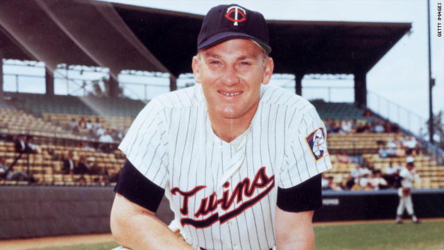

```{r Init, echo=FALSE, message=FALSE, warning=FALSE}
library(tidyverse)
library(readxl)
library(lubridate)
library(Lahman)
library(XML)
library(RCurl)
library(rlist)
library(knitr)
library(grid)
library(xtable)
library(scales)
library(reshape2)
library(RColorBrewer)
library(kableExtra)

opts_chunk$set(echo=FALSE,
               cache=TRUE, autodep=TRUE, cache.comments=FALSE,
               message=FALSE, warning=FALSE)

source("../Baseball/Baseball_Functions.r")
```

# Colorado Rockies Statistics Snapshot


```{r FirstStats, results='asis'}
theurl <- getURL("https://www.baseball-reference.com/leagues/NL/2018-standings.shtml#expanded_standings_C::none")
tables <- readHTMLTable(theurl)
tables <- list.clean(tables, fun = is.null, recursive = FALSE)
n.rows <- unlist(lapply(tables, function(t) dim(t)[1]))

knitr::kable(tables$standings_W, caption = "NL West Standings")

Current <- getCurrentResults()
WINS <- Current$Wins
LOSSES <- Current$Losses
WPCT <- Current$Win.Pct
TotalR <- Current$Runs
TotalRA <- Current$Runs.Ag

knitr::kable(Current, digits = 3,
       caption = paste("Current Rockies Results as of", Sys.Date(), sep = " "))
```


\newpage

#  Colorado Rockies Weekly Newletter

```{r ,fig.height= 2.0}
knitr::include_graphics("images/Colorado-Rockies-Logo2.jpg")
```


```{r Headline,fig.cap = "Harmon Killibrew, (Born: June 29, 1936, Payette, ID Died: May 17, 2011, Scottsdale, AZ).", fig.width = 6}



```

> "Life is precious and time is a key element. Let's make every moment count and help those who have a greater need than our own." ~ Harmon Killibrew

\newpage

## Week #5


* **Colorado Rockies Dashboard**
    + The Baseball Codes
    + Rockies Win/Loss Graphs for 2018 and 2007
    + Top Twelve Rockies Players as Measured by WAR
    + National and American League Standings
    + Game-by-Game Results
    + **Pythagorean Theorem** prediction of the number of wins.
    + Batting Statistics (for non-pitchers)
    + Pitching Statistics
    + National League Team Standard Batting
    + Current Injuries **Updated**

The source data for this article can be found at URL [http://baseball-reference.com](http://baseball-reference.com).

## The Baseball Codes

My daughter gave me two books for Christmas.  My daughter is a keen observer of her father's geekishness.  One of the books she gave me is titled, **The Baseball Codes: Beanballs, Sign Stealing, and Bench-Clearing Brawls: The Unwritten Rules of America's Pastime** by Jason Turbow and Michael Duca.  The book uncovers the literally, inside-baseball codes of conduct.  For instance, its considered bad form to steal a base while your team is ahead in the late innings.  Gloating inside the batter's box is considered a "bowtie" offense (neck-high and inside fastball thrown in such a way to cause the batter to bail out of the batter's box and in some cases, fall down).  For full a disclosure and endoresment, here is the link to the book on Amazon: [The Baseball Codes: Beanballs, Sign Stealing, and Bench-Clearing Brawls: The Unwritten Rules of America's Pastime](https://www.amazon.com/Baseball-Codes-Beanballs-Bench-Clearing-Unwritten/dp/030727862X/ref=sr_1_1?ie=UTF8&qid=1525921688&sr=8-1&keywords=The+Code+Baseball)

Watch this space, more stories from The Baseball Codes in future newsletters.

\newpage

# Colorado Rockies Dashboard
## Win Loss Margin

One of the many ways to visualize a teams performance is to show wins and losses as the margin of the win (positive) or loss (negative).  In the graphs below, we show the current season performance.  For emphasis, wins are displayed in green (above the zero) and losses in red (below).

Following the current season's graph, I have included the Win/Loss margin chart for our benchmark season of 2007 when the Rockies won the National League pennant.  

```{r GBG18}
GBG18 <- suppressWarnings(getRockiesGBG(2018))

# Calculate Cumulative Wins and Losses
GBG18 <- GBG18 %>%  
  mutate(WinG = ifelse( grepl('W',GBG18$'W/L'), 1, 0)) %>% 
  mutate(LossG = ifelse(grepl('L',GBG18$'W/L'),1,0))
GBG18 <- GBG18 %>% mutate(C.WinG = cumsum(WinG)) %>%
      mutate(C.LossG = cumsum(LossG)) %>%
      mutate(Date.Full = as.Date(paste(trimws(GBG18$Date), ", 2018", sep =""), 
                                 format ="%B %d, %Y"))
```

```{r WinLossMargin18,fig.height=3.5,fig.width=6.5}

# Produce Win/Loss Margin Plot

GBG18$Date <- trimws(GBG18$Date)
D <- tibble(Date = GBG18$Date, Year = 2018, WLMargin = GBG18$R - GBG18$RA, 
            DN = GBG18$`D/N`, HA = GBG18$`H/A`, WLsign = " ")
D <- D %>% separate(Date, into = c("Month", "Day"), sep =" ")

D$WLsign <-  ifelse(D$WLMargin < 0, "Loss", "Win")


D$Month <- match(tolower(D$Month), tolower(month.abb))
D$Date <- with(D, as.Date(paste(Year, Month, Day, sep = "/")))

p1 <- ggplot(D, aes(x = Date, y = WLMargin, fill = WLsign)) + 
  geom_bar(stat = "identity", position = position_dodge(width=0.8)) + 
  guides(fill=FALSE) +
  scale_fill_manual(values= c("Win" = "green3", "Loss" = "red")) +
  scale_x_date(date_breaks = "1 month", date_minor_breaks = "1 week", date_labels = "%B") +
  ggtitle("Rockies 2018 Win/Loss Margin") + xlab("Game Date") + ylab("Game Margin (runs)")

```


```{r GBG07}
GBG07 <- suppressWarnings(getRockiesGBG(2007))

# Calculate Cumulative Wins and Losses
GBG07 <- GBG07 %>%  
  mutate(WinG = ifelse( grepl('W',GBG07$'W/L'), 1, 0)) %>% 
  mutate(LossG = ifelse(grepl('L',GBG07$'W/L'),1,0))
GBG07 <- GBG07 %>% mutate(C.WinG = cumsum(WinG)) %>%
      mutate(C.LossG = cumsum(LossG)) %>%
      mutate(Date.Full = as.Date(paste(trimws(GBG07$Date), ", 2017", sep =""), 
                                 format ="%B %d, %Y"))
```

```{r WinLossMargin07,fig.height=3.5, fig.width=6.5}

# Produce Win/Loss Margin Plot

GBG07$Date <- trimws(GBG07$Date)
D <- tibble(Date = GBG07$Date, Year = 2007, WLMargin = GBG07$R - GBG07$RA, 
            DN = GBG07$`D/N`, HA = GBG07$`H/A`)
D <- D %>% separate(Date, into = c("Month", "Day"), sep =" ")
D$WLsign = ifelse(D$WLMargin < 0, "Loss", "Win")

D$Month <- match(tolower(D$Month), tolower(month.abb))
D$Date <- with(D, as.Date(paste(Year, Month, Day, sep = "/")))

p2 <- ggplot(D, aes(x = Date, y = WLMargin, fill = WLsign)) + 
  geom_bar(stat = "identity", position = position_dodge(width=0.8)) + 
  guides(fill=FALSE) +
  scale_fill_manual(values= c("Win" = "green3", "Loss" = "red")) +
  scale_x_date(date_breaks = "1 month", date_minor_breaks = "1 week", date_labels = "%B") +
  ggtitle("Rockies 2007 Win/Loss Margin") + xlab("Game Date") + ylab("Game Margin (runs)")

p1
p2
```

\newpage

## Top Twelve Rockies Players as Measured by WAR

While early in the season, we will pull this data frequently.  

```{r Top12Rockies}

defSalary <- 545000  
# Get latest Batting and Pitching WAR Data
if(!exists("batWar")) {batWar <- getDailyBatWar()}
if(!exists("pitWar")) {pitWar <- getDailyPitWar()}

# Add WAR Field to roster
url <- 
  "https://www.baseball-reference.com/teams/COL/2018-roster.shtml#appearances::none"
doc <- getURL(url)
cClasses <- c("character", "integer",   "character", "character", "character",
              "character", "integer",   "character", "integer",   "integer",
              "integer",   "integer",   "integer",   "integer",   "integer",
              "integer",   "integer",   "integer",   "integer",   "integer",
              "integer",   "integer",   "integer",   "integer",   "integer",
              "integer",   "double",   "character",    "character")
tables <- suppressWarnings(readHTMLTable(doc, header = TRUE, 
              stringsAsFactors = FALSE, colClasses = cClasses))

roster <- tables[[2]]
tnames <- names(roster)
tnames[3] <- "Nat"
tnames[28] <- "Salary"
tnames[29] <- "Note"
colnames(roster) <- tnames
roster <- as_tibble(roster) 


# Salary data not yet populated in baseball-reference roster data
# # Cleanup Salary field
# roster$Salary <- suppressWarnings(sapply(roster$Salary, 
#                     function(xx) as.numeric(gsub('[^0-9]', '', xx))))
# roster$Salary[is.na(roster$Salary)] <- defSalary

# Separate top players by WAR
top12 <- head(arrange(roster,desc(WAR)),n = 12) ## %>% mutate(Salary.M = Salary/1e6)
top12$Rank <- 1:12
# knitr::kable(top12[,c(31,1,2,27,30)], cap = "Rockies Top 12 Players (WAR)")
knitr::kable(top12[,c(30,1,2,27)], cap = "Rockies Top 12 Players (WAR)")

```

\newpage

## [National League Standings](http://www.baseball-reference.com/leagues/NL/2017-standings.shtml#expanded_standings_W::none)


```{r NLStandings2, results='asis'}
theurl <- getURL("https://www.baseball-reference.com/leagues/NL/2018-standings.shtml#expanded_standings_W::none")
tables <- readHTMLTable(theurl)
tables <- list.clean(tables, fun = is.null, recursive = FALSE)
n.rows <- unlist(lapply(tables, function(t) dim(t)[1]))
knitr::kable(tables$standings_E, caption = "NL East Standings")
knitr::kable(tables$standings_C, caption = "NL Central Standings")
knitr::kable(tables$standings_W, caption = "NL West Standings")
```

\newpage

## [American League Standings](http://www.baseball-reference.com/leagues/AL/2017-standings.shtml#expanded_standings_W::none)

```{r ALStandings, results = 'asis'}

ALurl <- getURL("https://www.baseball-reference.com/leagues/AL/2018-standings.shtml#expanded_standings_W::none")
ALStandings <- readHTMLTable(ALurl)
#ALStandings <- list.clean(ALStandings, fun = is.null, recursive = FALSE)
n.rows <- unlist(lapply(ALStandings, function(t) dim(t)[1]))
knitr::kable(ALStandings$standings_E, caption = "AL East Standings")
knitr::kable(ALStandings$standings_C, caption = "AL Central Standings")
knitr::kable(ALStandings$standings_W, caption = "AL West Standings")
```

\newpage

## Rockies Game-by-Game Schedule/Results

```{r GBGResults, results = 'asis'}
GBG18 <- getRockiesGBG(2018) 
GBG18 <- filter(GBG18, Win != " ") %>%
  filter(Win != "Win")
knitr::kable(GBG18[,c(1:13)])
```


The Rockies current record is `r Current$Wins` Wins and `r Current$Losses` Losses.  So far, the Rockies have scored `r TotalR` runs and have had `r TotalRA` runs scored against them.

\newpage

## Pythagorean Win-Loss Theorem
$$ predicted W\% = \frac{R^k}{R^k+RA^k}   $$
```{r PredWin, echo=FALSE, message=FALSE, warning=FALSE, results='asis'}
# Build Table of Pythagorean Win Predictions for 2017
PredictedWins <- tibble(
  `Wins (k=1.81)` = round(TotalR^1.81/(TotalR^1.81+TotalRA^1.81)*162),
  `Wins (k=1.83)` = round(TotalR^1.83/(TotalR^1.83+TotalRA^1.83)*162),
  `Wins (k=2.00)` = round(TotalR^2.00/(TotalR^2.00+TotalRA^2.00)*162))
```

Using the commonly used values of k, the Rockies predicted wins for the 2017 are shown in the table below.  Remember this statistic will vary widely over the course of the season.

```{r PredWins, echo=FALSE, message=FALSE, warning=FALSE, results='asis'}
knitr::kable(PredictedWins, caption = "Predicted Wins for Entire 2017 Season")
```

\newpage

## Batting Statistics (non-pitchers)


```{r, echo=FALSE, message=FALSE, warning=FALSE, results= 'asis'}

burl <- 
  getURL("https://www.baseball-reference.com/teams/COL/2018.shtml#team_batting::none")

  TeamStats <- readHTMLTable(burl)
  #TeamStats <- list.clean(TeamStats, fun = is.null, recursive = FALSE)
  TeamBatting <- as_tibble(TeamStats$team_batting) %>%
       separate(Name, into = c("First", "Name"), sep =" ")
TEAMB <- TeamBatting %>% 
  select(c(1,2,4,5,6,8,9,10,11,12,13, 14, 15, 16, 17)) %>%   
  filter(Rk != "Rk" & Pos != "P")
knitr::kable(TEAMB, caption = "Rockies Batting Statistics (1 of 2).")

TEAMB <- TeamBatting %>% 
  select(c(1,2,4,5,18,19,20,21,22,23:29)) %>%   
  filter(Rk != "Rk" & Pos != "P")
knitr::kable(TEAMB, caption = "Rockies Batting Statistics (2 of 2).")
```

* \* - bats left-handed, # - bats both, else - bats right, ? - unknown; OPS_lg for OPS+ does not include pitchers.

\newpage

## Pitching Statistics

```{r, echo=FALSE, message=FALSE, warning=FALSE, results='asis'}

PitchUrl <- 
  getURL("http://www.baseball-reference.com/teams/COL/2018.shtml#team_pitching::none")

  PitchStats <- readHTMLTable(PitchUrl)
  #PitchStats <- list.clean(PitchStats, fun = is.null, recursive = FALSE)
  TeamPitching <- as_tibble(TeamStats$team_pitching) %>%
       separate(Name, into = c("First", "Name"), sep =" ")

  TEAMP <- TeamPitching %>%   
  filter(Rk != "Rk") %>%
  select(c(1,2, 4, 5:18))
knitr::kable(TEAMP, caption = "Rockies pitching statistics (1 of 2).")

TEAMP <- TeamPitching %>%
  filter(Rk != "Rk")  %>%
  select(c(1,2, 4, 19:30))
knitr::kable(TEAMP, caption = "Rockies pitching statistics (2 of 2).")

```

  \* - throws left-handed

\newpage

## National League Team Standard Batting

```{r}
NLTeamBatUrl <- 
  getURL("https://www.baseball-reference.com/leagues/NL/2018.shtml#teams_standard_batting::3")

C.Classes <- c("character", "integer", rep("double",2), rep("integer",13), 
               rep("double",4), rep("integer",8))

BatStats <- readHTMLTable(NLTeamBatUrl,stringsAsFactors = FALSE, colClasses = C.Classes)
#BatStats <- list.clean(BatStats, fun = is.null, recursive = FALSE)
NLBatStats <- as_tibble(BatStats$teams_standard_batting, as.factor = FALSE)
  
TEAMB <- NLBatStats %>% arrange(desc(NLBatStats$'R/G')) %>%  select(c(1:4, 5:17))
knitr::kable(TEAMB, caption = "NL Team Batting statistics (1 of 2).")

TEAMB <- NLBatStats %>% arrange(desc(NLBatStats$'R/G')) %>%  select(c(1:4, 18:29))
knitr::kable(TEAMB, caption = "NL Team Batting statistics (2 of 2).")


```


\newpage

## Current Injuries

```{r, echo=FALSE, message=FALSE, warning=FALSE, results= 'asis'}
#library(kableExtra)
Injuries <- read_excel("./data/Rockies_Injuries.xlsx")
  
Injuries <- select(Injuries,c(1,3,4,5)) 
Injuries <-  rename(Injuries, Updated = Last.Updated, 
                      Type = Injury.Type, Details = Injury.Details)
 
knitr::kable(Injuries, "latex", caption = "Rockies Current Injuries",
      col.names = c("Name", "Updated", "Type", "Details")) %>%
      column_spec(4, width = "10cm")

# print(knitr::kable(Injuries, caption = "Rockies Current Injuries",
#       col.names = c("Name", "Updated", "Type", "Details")))


```


Run date time: `r Sys.time()`