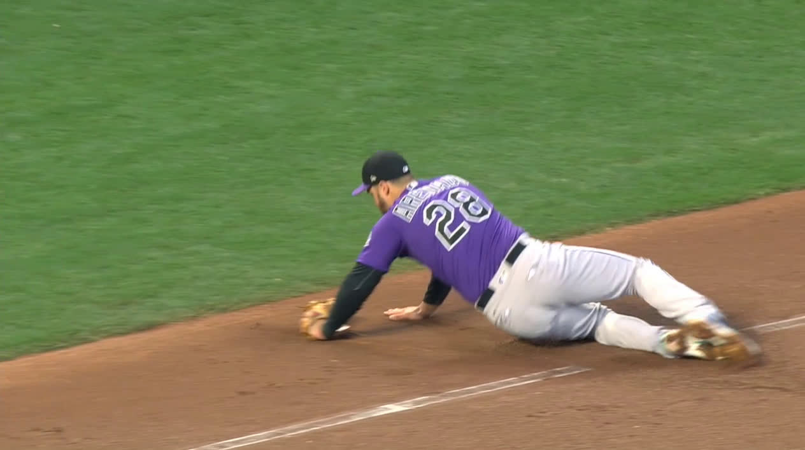

```{r Init, echo=FALSE, message=FALSE, warning=FALSE}
library(tidyverse)
library(readxl)
library(lubridate)
library(Lahman)
library(XML)
library(RCurl)
library(rlist)
library(knitr)
library(grid)
library(xtable)
library(scales)
library(reshape2)
library(RColorBrewer)
library(kableExtra)

opts_chunk$set(echo=FALSE,
               cache=TRUE, autodep=TRUE, cache.comments=FALSE,
               message=FALSE, warning=FALSE)

source("../Baseball/Baseball_Functions.r")
```

# Colorado Rockies Statistics Snapshot


```{r FirstStats, results='asis'}
theurl <- getURL("https://www.baseball-reference.com/leagues/NL/2018-standings.shtml#expanded_standings_C::none")
tables <- readHTMLTable(theurl)
tables <- list.clean(tables, fun = is.null, recursive = FALSE)
n.rows <- unlist(lapply(tables, function(t) dim(t)[1]))

knitr::kable(tables$standings_W, caption = "NL West Standings")

Current <- getCurrentResults()
WINS <- Current$Wins
LOSSES <- Current$Losses
WPCT <- Current$Win.Pct
TotalR <- Current$Runs
TotalRA <- Current$Runs.Ag

knitr::kable(Current, digits = 3,
       caption = paste("Current Rockies Results as of", Sys.Date(), sep = " "))
```


\newpage


```{r Headline,fig.cap = "Nolan Arenado makes a diving stop and throws the runner out from his knees.", fig.width = 6}



```

> "Baseball is a red-blooded sport for red-blooded men. It's no pink tea, and mollycoddles had better stay out. It's a struggle for supremacy, a survival of the fittest." ~ Ty Cobb

\newpage

#  Colorado Rockies Weekly Newletter

```{r ,fig.height= 2.0}
knitr::include_graphics("images/Colorado-Rockies-Logo2.jpg")
```

## Week #7


* **Colorado Rockies Dashboard**
    + The Baseball Codes
    + **Special for Cath Cox** - Tulowitzki versus Arenado  
    + Rockies Win/Loss Graphs for 2018 and 2007
    + Top Twelve Rockies Players as Measured by WAR
    + National and American League Standings
    + Game-by-Game Results
    + **Pythagorean Theorem** prediction of the number of wins.
    + Batting Statistics (for non-pitchers)
    + Pitching Statistics
    + National League Team Standard Batting
    + Current Injuries **Updated**

The source data for this article can be found at URL [http://baseball-reference.com](http://baseball-reference.com).


\newpage

## The Baseball Codes

The week the Baseball Codes story was originally posted by Jason Turbow April 30,2018 in his blog.  It has to do with celebration and when it **may** be ill-advised.

### Celebrate Good Times, Come On! (Or Don’t, Depending On Your Perspective) by Jason Turbow 

 	Celebrate Good Times, Come On! (Or Don’t, Depending On Your Perspective)
by Jason Turbow 
 
It seems that there are some growing pains as baseball transitions from The Sport Of Tradition-Gripping Dryness to something a little bit looser. As it turns out, even those known to celebrate from time to time have limits.

On Saturday in Kansas City, Chicago’s Tim Anderson hit a leadoff homer, proceeded to watch it, then unleashed some self-congratulatory invective as he rounded the bases. Royals catcher Salvador Perez took note while recalling that Anderson acted similarly after hitting a pair of home runs on opening day, also against the Royals. As the runner crossed home plate, Perez said something to him about it. Anderson patted him on the chest protector and trotted back to his bench.

> Tim Anderson lead off tonight's game with our third leadoff home run of the week! pic.twitter.com/R7FkTc80GZ
— Chicago White Sox (@whitesox) April 29, 2018
Things picked up again in the bottom half of the inning, when Perez reached second base on an error and a two-out walk, at which point he opted to continue the conversation with Anderson. He and the shortstop ended up nose to nose, with teammates spilling out of the dugout to separate them.
#WhiteSox @ #Royals [Game 2] 
Tim Anderson and Salvador Perez get into it at second base, which leads to the benches clearing, before Anderson and Perez make up (01:30)
MLB Gameday: https://t.co/wua5CHodGw pic.twitter.com/wziRupG780
— Ballpark Videos (@BallparkVids) April 29, 2018

“I don’t have any problems with the guy hitting a homer, taking a couple steps, walk two steps and keep running,” said Perez after the game, in a Kansas City Star report. “But when you start to get loud, to say some bad words ... I don’t like that. He had to respect my team and my pitcher. We’re professional in here. I don’t like that and he told me at second base, ‘I like to have fun, Salvy, what do you want me to do?’ I was like, ‘OK, we like to have fun too. I like to have fun. You see me every day out there, laughing and having fun every day. But I don’t disrespect your team. I respect your team, too. I hit some homers too, I keep running the bases, I don’t get loud like you.’ That’s the only thing I told him. Keep doing what you’re doing, bro, have fun, but again respect my team. That’s it. So he was mad about that. What you want me to do? I can’t do anything about that.”

(Perez did himself no favors when he also told reporters: “If you’re gonna keep doing that ... I’m going to hit you. I’m going to tell the pitcher to hit him. ... If you want to fight, let’s fight.” Intentionally drilling an opponent for what is essentially inconsequential behavior will not play well in retrospect should a Royals pitcher actually dot Anderson in a future encounter.)

Anderson, of course, got into it just last week, for similar reasons, with Justin Verlander. The guy likes to celebrate. For his reaction to it, Perez was labeled as a member of “the fun police” by various sources. There are, however, some considerations.

For those in Anderson’s camp who decry the stifling of emotion on a ballfield, let’s take the conversation to its logical conclusion: At what point does celebration become overkill? A classic Barry Bonds pirouette, only while running the bases instead of standing in the batter’s box? Summersaults? Ripping off one’s uniform jersey, like they do in soccer? The question is not aimed at painting false equivalency, but wondering about the point at which a player’s behavior—presuming that none of it is aimed at the opposition—might eventually cross the line, even for those who support that kind of thing. Baseball is obviously more lenient now than it was during past generations, but how lenient is it, really?

I think the answer can be found in what came next, after Anderson's confrontation with Perez.
Duda’s walk—the play that advanced Perez to second—loaded the bases. The next batter, Abraham Almonte, hit a sharp grounder to shortstop that Anderson booted, allowing Mike Moustakas to score from third. (It was ruled a single, but easily could have been an error. Watch it here.) Alex Gordon followed by stroking a two-run single to center, giving the Royals a 3-1 lead in a game they ended up winning, 5-2.

Anderson’s confrontation last week against Verlander ended with him getting picked off of second base at a point in which the pitcher was on the ropes and the White Sox desperately needed baserunners. This one ended with the Royals scoring three runs that might have remained off the board had Chicago's shortstop been less distracted.

And there it is: Anderson’s shtick will eventually become too much, even for his most ardent supporters, when it begins to interfere with his team’s chances to win baseball games. Based on the above examples, he may already have reached that point.
 
\newpage

## **Special for Cath Cox** - Tulowitzki versus Arenado  

The question is how do Arenado and Tulowitzki compare in terms of their batting and fielding performance.  This week, we will present the raw data about their batting numbers.  As some of the readers know, the story is not completely told without graphics.  So, next week, we do pictures.  
 
```{r TuloArenado}

tuloUrl <- "https://www.baseball-reference.com/players/t/tulowtr01.shtml#batting_standard::none"
doc <- getURL(tuloUrl)
tuloTables <- readHTMLTable(doc, header = TRUE, stringsAsFactors = FALSE)
tuloBatting <- as.tibble(tuloTables$`batting_standard`)
knitr::kable(tuloBatting[,c(1:20)], format = "latex", 
             caption = "Troy Tulowitzki - Minor and Major League Batting Performance")  %>%
  kable_styling(latex_options = c("striped", "scale_down", "hold_position"))

arenUrl <- "https://www.baseball-reference.com/players/a/arenano01.shtml#batting_standard::none"
doc <- getURL(arenUrl)
areTables <- readHTMLTable(doc, header = TRUE, stringsAsFactors = FALSE)
areBatting <- as.tibble(areTables$`batting_standard`)
knitr::kable(areBatting[,c(1:20)], format = "latex", 
             caption = "Nolan Arenado - Minor and Major League Batting Performance") %>%
  kable_styling(latex_options = c("striped", "scale_down", "hold_position")) 


```
 
 


\newpage

# Colorado Rockies Dashboard
## Win Loss Margin

One of the many ways to visualize a teams performance is to show wins and losses as the margin of the win (positive) or loss (negative).  In the graphs below, we show the current season performance.  For emphasis, wins are displayed in green (above the zero) and losses in red (below).

Following the current season's graph, I have included the Win/Loss margin chart for our benchmark season of 2007 when the Rockies won the National League pennant.  

```{r GBG18}
GBG18 <- suppressWarnings(getRockiesGBG(2018))

# Calculate Cumulative Wins and Losses
GBG18 <- GBG18 %>%  
  mutate(WinG = ifelse( grepl('W',GBG18$'W/L'), 1, 0)) %>% 
  mutate(LossG = ifelse(grepl('L',GBG18$'W/L'),1,0))
GBG18 <- GBG18 %>% mutate(C.WinG = cumsum(WinG)) %>%
      mutate(C.LossG = cumsum(LossG)) %>%
      mutate(Date.Full = as.Date(paste(trimws(GBG18$Date), ", 2018", sep =""), 
                                 format ="%B %d, %Y"))
```

```{r WinLossMargin18,fig.height=3.5,fig.width=6.5}

# Produce Win/Loss Margin Plot

GBG18$Date <- trimws(GBG18$Date)
D <- tibble(Date = GBG18$Date, Year = 2018, WLMargin = GBG18$R - GBG18$RA, 
            DN = GBG18$`D/N`, HA = GBG18$`H/A`, WLsign = " ")
D <- D %>% separate(Date, into = c("Month", "Day"), sep =" ")

D$WLsign <-  ifelse(D$WLMargin < 0, "Loss", "Win")


D$Month <- match(tolower(D$Month), tolower(month.abb))
D$Date <- with(D, as.Date(paste(Year, Month, Day, sep = "/")))

p1 <- ggplot(D, aes(x = Date, y = WLMargin, fill = WLsign)) + 
  geom_bar(stat = "identity", position = position_dodge(width=0.8)) + 
  guides(fill=FALSE) +
  scale_fill_manual(values= c("Win" = "green3", "Loss" = "red")) +
  scale_x_date(date_breaks = "1 month", date_minor_breaks = "1 week", date_labels = "%B") +
  ggtitle("Rockies 2018 Win/Loss Margin") + xlab("Game Date") + ylab("Game Margin (runs)")

```


```{r GBG07}
GBG07 <- suppressWarnings(getRockiesGBG(2007))

# Calculate Cumulative Wins and Losses
GBG07 <- GBG07 %>%  
  mutate(WinG = ifelse( grepl('W',GBG07$'W/L'), 1, 0)) %>% 
  mutate(LossG = ifelse(grepl('L',GBG07$'W/L'),1,0))
GBG07 <- GBG07 %>% mutate(C.WinG = cumsum(WinG)) %>%
      mutate(C.LossG = cumsum(LossG)) %>%
      mutate(Date.Full = as.Date(paste(trimws(GBG07$Date), ", 2017", sep =""), 
                                 format ="%B %d, %Y"))
```

```{r WinLossMargin07,fig.height=3.5, fig.width=6.5}

# Produce Win/Loss Margin Plot

GBG07$Date <- trimws(GBG07$Date)
D <- tibble(Date = GBG07$Date, Year = 2007, WLMargin = GBG07$R - GBG07$RA, 
            DN = GBG07$`D/N`, HA = GBG07$`H/A`)
D <- D %>% separate(Date, into = c("Month", "Day"), sep =" ")
D$WLsign = ifelse(D$WLMargin < 0, "Loss", "Win")

D$Month <- match(tolower(D$Month), tolower(month.abb))
D$Date <- with(D, as.Date(paste(Year, Month, Day, sep = "/")))

p2 <- ggplot(D, aes(x = Date, y = WLMargin, fill = WLsign)) + 
  geom_bar(stat = "identity", position = position_dodge(width=0.8)) + 
  guides(fill=FALSE) +
  scale_fill_manual(values= c("Win" = "green3", "Loss" = "red")) +
  scale_x_date(date_breaks = "1 month", date_minor_breaks = "1 week", date_labels = "%B") +
  ggtitle("Rockies 2007 Win/Loss Margin") + xlab("Game Date") + ylab("Game Margin (runs)")

p1
p2
```

\newpage

## Top Twelve Rockies Players as Measured by WAR

While early in the season, we will pull this data frequently.  

```{r Top12Rockies}

defSalary <- 545000  
# Get latest Batting and Pitching WAR Data
if(!exists("batWar")) {batWar <- getDailyBatWar()}
if(!exists("pitWar")) {pitWar <- getDailyPitWar()}

# Add WAR Field to roster
url <- 
  "https://www.baseball-reference.com/teams/COL/2018-roster.shtml#appearances::none"
doc <- getURL(url)
cClasses <- c("character", "integer",   "character", "character", "character",
              "character", "integer",   "character", "integer",   "integer",
              "integer",   "integer",   "integer",   "integer",   "integer",
              "integer",   "integer",   "integer",   "integer",   "integer",
              "integer",   "integer",   "integer",   "integer",   "integer",
              "integer",   "double",   "character",    "character")
tables <- suppressWarnings(readHTMLTable(doc, header = TRUE, 
              stringsAsFactors = FALSE, colClasses = cClasses))

roster <- tables[[2]]
tnames <- names(roster)
tnames[3] <- "Nat"
tnames[28] <- "Salary"
tnames[29] <- "Note"
colnames(roster) <- tnames
roster <- as_tibble(roster) 


# Salary data not yet populated in baseball-reference roster data
# # Cleanup Salary field
# roster$Salary <- suppressWarnings(sapply(roster$Salary, 
#                     function(xx) as.numeric(gsub('[^0-9]', '', xx))))
# roster$Salary[is.na(roster$Salary)] <- defSalary

# Separate top players by WAR
top12 <- head(arrange(roster,desc(WAR)),n = 12) ## %>% mutate(Salary.M = Salary/1e6)
top12$Rank <- 1:12
# knitr::kable(top12[,c(31,1,2,27,30)], cap = "Rockies Top 12 Players (WAR)")
knitr::kable(top12[,c(30,1,2,27)], cap = "Rockies Top 12 Players (WAR)")

```

\newpage

## [National League Standings](http://www.baseball-reference.com/leagues/NL/2017-standings.shtml#expanded_standings_W::none)


```{r NLStandings2, results='asis'}
theurl <- getURL("https://www.baseball-reference.com/leagues/NL/2018-standings.shtml#expanded_standings_W::none")
tables <- readHTMLTable(theurl)
tables <- list.clean(tables, fun = is.null, recursive = FALSE)
n.rows <- unlist(lapply(tables, function(t) dim(t)[1]))
knitr::kable(tables$standings_E, caption = "NL East Standings")
knitr::kable(tables$standings_C, caption = "NL Central Standings")
knitr::kable(tables$standings_W, caption = "NL West Standings")
```

\newpage

## [American League Standings](http://www.baseball-reference.com/leagues/AL/2017-standings.shtml#expanded_standings_W::none)

```{r ALStandings, results = 'asis'}

ALurl <- getURL("https://www.baseball-reference.com/leagues/AL/2018-standings.shtml#expanded_standings_W::none")
ALStandings <- readHTMLTable(ALurl)
#ALStandings <- list.clean(ALStandings, fun = is.null, recursive = FALSE)
n.rows <- unlist(lapply(ALStandings, function(t) dim(t)[1]))
knitr::kable(ALStandings$standings_E, caption = "AL East Standings")
knitr::kable(ALStandings$standings_C, caption = "AL Central Standings")
knitr::kable(ALStandings$standings_W, caption = "AL West Standings")
```

\newpage

## Rockies Game-by-Game Schedule/Results

```{r GBGResults, results = 'asis'}
GBG18 <- getRockiesGBG(2018) 
GBG18 <- filter(GBG18, Win != " ") %>%
  filter(Win != "Win")
knitr::kable(GBG18[,c(1:13)])
```


The Rockies current record is `r Current$Wins` Wins and `r Current$Losses` Losses.  So far, the Rockies have scored `r TotalR` runs and have had `r TotalRA` runs scored against them.

\newpage

## Pythagorean Win-Loss Theorem
$$ predicted W\% = \frac{R^k}{R^k+RA^k}   $$
```{r PredWin, echo=FALSE, message=FALSE, warning=FALSE, results='asis'}
# Build Table of Pythagorean Win Predictions for 2017
PredictedWins <- tibble(
  `Wins (k=1.81)` = round(TotalR^1.81/(TotalR^1.81+TotalRA^1.81)*162),
  `Wins (k=1.83)` = round(TotalR^1.83/(TotalR^1.83+TotalRA^1.83)*162),
  `Wins (k=2.00)` = round(TotalR^2.00/(TotalR^2.00+TotalRA^2.00)*162))
```

Using the commonly used values of k, the Rockies predicted wins for the 2017 are shown in the table below.  Remember this statistic will vary widely over the course of the season.

```{r PredWins, echo=FALSE, message=FALSE, warning=FALSE, results='asis'}
knitr::kable(PredictedWins, caption = "Predicted Wins for Entire 2017 Season")
```

\newpage

## Batting Statistics (non-pitchers)


```{r, echo=FALSE, message=FALSE, warning=FALSE, results= 'asis'}

burl <- 
  getURL("https://www.baseball-reference.com/teams/COL/2018.shtml#team_batting::none")

  TeamStats <- readHTMLTable(burl)
  #TeamStats <- list.clean(TeamStats, fun = is.null, recursive = FALSE)
  TeamBatting <- as_tibble(TeamStats$team_batting) %>%
       separate(Name, into = c("First", "Name"), sep =" ")
TEAMB <- TeamBatting %>% 
  select(c(1,2,4,5,6,8,9,10,11,12,13, 14, 15, 16, 17)) %>%   
  filter(Rk != "Rk" & Pos != "P")
knitr::kable(TEAMB, caption = "Rockies Batting Statistics (1 of 2).")

TEAMB <- TeamBatting %>% 
  select(c(1,2,4,5,18,19,20,21,22,23:29)) %>%   
  filter(Rk != "Rk" & Pos != "P")
knitr::kable(TEAMB, caption = "Rockies Batting Statistics (2 of 2).")
```

* \* - bats left-handed, # - bats both, else - bats right, ? - unknown; OPS_lg for OPS+ does not include pitchers.

\newpage

## Pitching Statistics

```{r, echo=FALSE, message=FALSE, warning=FALSE, results='asis'}

PitchUrl <- 
  getURL("http://www.baseball-reference.com/teams/COL/2018.shtml#team_pitching::none")

  PitchStats <- readHTMLTable(PitchUrl)
  #PitchStats <- list.clean(PitchStats, fun = is.null, recursive = FALSE)
  TeamPitching <- as_tibble(TeamStats$team_pitching) %>%
       separate(Name, into = c("First", "Name"), sep =" ")

  TEAMP <- TeamPitching %>%   
  filter(Rk != "Rk") %>%
  select(c(1,2, 4, 5:18))
knitr::kable(TEAMP, caption = "Rockies pitching statistics (1 of 2).")

TEAMP <- TeamPitching %>%
  filter(Rk != "Rk")  %>%
  select(c(1,2, 4, 19:30))
knitr::kable(TEAMP, caption = "Rockies pitching statistics (2 of 2).")

```

  \* - throws left-handed

\newpage

## National League Team Standard Batting

```{r}
NLTeamBatUrl <- 
  getURL("https://www.baseball-reference.com/leagues/NL/2018.shtml#teams_standard_batting::3")

C.Classes <- c("character", "integer", rep("double",2), rep("integer",13), 
               rep("double",4), rep("integer",8))

BatStats <- readHTMLTable(NLTeamBatUrl,stringsAsFactors = FALSE, colClasses = C.Classes)
#BatStats <- list.clean(BatStats, fun = is.null, recursive = FALSE)
NLBatStats <- as_tibble(BatStats$teams_standard_batting, as.factor = FALSE)
  
TEAMB <- NLBatStats %>% arrange(desc(NLBatStats$'R/G')) %>%  select(c(1:4, 5:17))
knitr::kable(TEAMB, caption = "NL Team Batting statistics (1 of 2).")

TEAMB <- NLBatStats %>% arrange(desc(NLBatStats$'R/G')) %>%  select(c(1:4, 18:29))
knitr::kable(TEAMB, caption = "NL Team Batting statistics (2 of 2).")


```


\newpage

## Current Injuries

```{r, echo=FALSE, message=FALSE, warning=FALSE, results= 'asis'}
#library(kableExtra)
Injuries <- read_excel("./data/Rockies_Injuries.xlsx")
  
Injuries <- select(Injuries,c(1,3,4,5)) 
Injuries <-  rename(Injuries, Updated = Last.Updated, 
                      Type = Injury.Type, Details = Injury.Details)
 
knitr::kable(Injuries, "latex", caption = "Rockies Current Injuries",
      col.names = c("Name", "Updated", "Type", "Details")) %>%
      column_spec(4, width = "10cm")

# print(knitr::kable(Injuries, caption = "Rockies Current Injuries",
#       col.names = c("Name", "Updated", "Type", "Details")))


```


Run date time: `r Sys.time()`