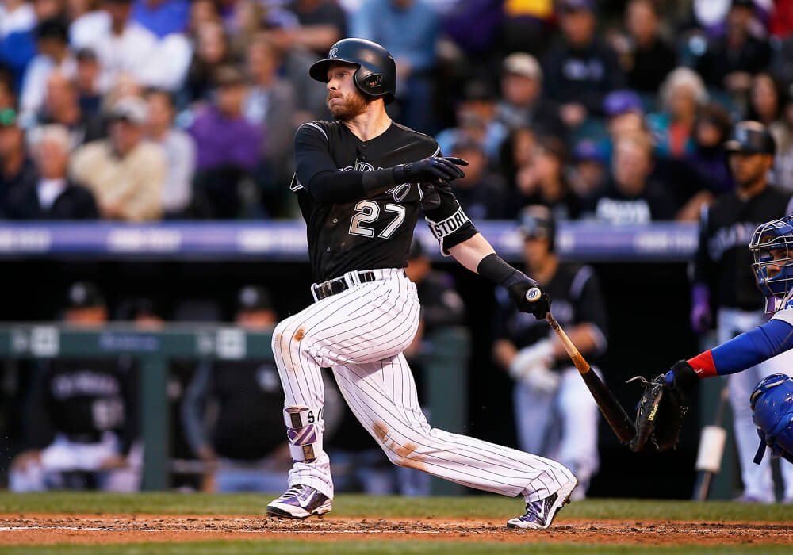

```{r Init, echo=FALSE, message=FALSE, warning=FALSE}
library(tidyverse)
library(readxl)
library(lubridate)
library(Lahman)
library(XML)
library(RCurl)
library(rlist)
library(knitr)
library(grid)
library(xtable)
library(flextable)
library(scales)
library(reshape2)
library(RColorBrewer)
library(kableExtra)

opts_chunk$set(echo=FALSE,
               cache=TRUE, autodep=TRUE, cache.comments=FALSE,
               message=FALSE, warning=FALSE)
HdrBg <- "lightsteelblue1"

source("../Baseball/Baseball_Functions.r")
```


```{r Headline,fig.cap = "Trevor Story is said to be in the running for this year's All-Star Game.", fig.width = 3}



```


> "The best way to find out if you can trust somebody is to trust them." ~ Earnest Hemingway

# Colorado Rockies Statistics Snapshot


```{r FirstStats, results='asis'}
theurl <- getURL("https://www.baseball-reference.com/leagues/NL/2018-standings.shtml#expanded_standings_C::none")
tables <- readHTMLTable(theurl)
tables <- list.clean(tables, fun = is.null, recursive = FALSE)
n.rows <- unlist(lapply(tables, function(t) dim(t)[1]))

# knitr::kable(tables$standings_W, caption = "NL West Standings")

ft <- flextable(tables$standings_W, col_keys = c("Tm", "W", "L", "WL.pct", "GB")) %>%
       theme_booktabs() %>%
       bg(bg = HdrBg, part = "header") %>%
       bg(i = ~ Tm == "Colorado Rockies", bg = "#EFEF99" ) %>%
       add_footer(Tm = "Rockies have fallen to fourth in their division.") %>%
       merge_at(j = 1:5, part = "footer")
autofit(ft)
     

```


```{r}

Current <- getCurrentResults()
WINS <- Current$Wins
LOSSES <- Current$Losses
WPCT <- Current$Win.Pct
TotalR <- Current$Runs
TotalRA <- Current$Runs.Ag

Curr <- Current %>% rename(Pred.Season.Wins = starts_with("Predicted"))

ft <- flextable(Curr, col_keys = c("Wins", "Losses", "Win.Pct", "Runs","Runs.Ag", 
          "Pred.Season.Wins")) %>%
       theme_booktabs() %>%
       bg(bg = HdrBg, part = "header")

autofit(ft)

# knitr::kable(Current, digits = 3,
#        caption = paste("Current Rockies Results as of", Sys.Date(), sep = " "))
```


\newpage


#  Colorado Rockies Weekly Newletter

```{r ,fig.height= 2.0}
knitr::include_graphics("images/Colorado-Rockies-Logo2.jpg")
```

## Week #13


* **Colorado Rockies Dashboard**
    + The Baseball Codes
    + Rockies Win/Loss Graphs for 2018 and 2007
    
The source data for this article can be found at URL [http://baseball-reference.com](http://baseball-reference.com).


\newpage

## The Baseball Codes

The week the Baseball Codes story was originally posted by Jason Turbow WThursday June 21, 2018 in his email newsletter.  This story involves chowderhead pitchers and  retaliation gone wrong.  Enjoy.

###  	When Bad Things Happen Because Nitwit Pitchers Respond To Perceived Slights In Ways That Are Detrimental To The Winning Of Games: The Hunter Strickland Experience by Jason Turbow 
 
by Jason Turbow 
 
This is what it looks like when retaliation goes wrong. Or maybe it’s what it looks like when a guy takes things too seriously. Or maybe it’s just what it looks like when one of baseball’s premier chowderheads is allowed to let loose his inner id at multiple touchpoints between mound and clubhouse.

We’re speaking, of course, about the Giants and Marlins, specifically of San Francisco's chowderheaded closer Hunter Strickland. To get into any of it, of course, necessitates a review of the recent history between these teams.

It may have started with Miami pitcher Dan Straily breaking Evan Longoria’s finger with a pitch on June 14, but that seems specious given that Hunter Strickland does not need external motivation like teammate injures to come completely unhinged. He does that plenty capably on his own. In the ninth inning of that very game, Strickland blew the save when Marlins rookie Lewis Brinson—batting .172—tied things up, 3-3, with a sacrifice fly. (The Giants ended up winning in 16, 6-3.)

The closer didn’t like that. The next time he faced Brinson, four days later in San Francisco, he buzzed the rookie’s tower with an up-and-in fastball. Brinson responded with a game-tying single, making him directly responsible for both of Strickland’s blown saves in the span of three appearances. Brinson gave a take-that flip of the bat as he motored toward first, and the Marlins ended up scoring three times against the closer to erase a two-run deficit and win, 5-4. That should have effectively been that.

It wasn’t, of course. Strickland was yanked after giving up three hits and two walks to the six batters he faced, and shared some thoughts with Brinson as he departed the field. Then he proceeded to into a fight with a clubhouse door … which he lost. Strickland, with a broken pinky on his throwing hand, will be out for up to eight weeks.

Serious love for him last night on @MLBNetwork !!! pic.twitter.com/tLQ5wARhp5
— ASOM (@ASOM233334) June 19, 2018

Because Baseball Men stick up for each other, and because pitchers’ fraternities are strong and frequently mystifying, the following night, Tuesday, Giants starter Dereck Rodriguez drilled Brinson. Maybe we should have expected this, given the proclamation from reliever Mark Melancon that Brinson "was disrespecting the game." More pertinently, Rodriguez is not only a rookie looking to gain acceptance from his veteran teammates, but is the son of a Hall of Fame catcher who no doubt called his fair share of intentional HBPs. The guy was raised on old-school lessons about how to approach this very kind of scenario.

The thing about old-school approaches, of course, is that they frequently elicit equal-and-opposite responses. So in the process of protecting a hotheaded teammate whose actions toward Brinson (or his own damn pitching hand) were in no way justified, Rodriguez reignited what should have by that point been a dormant feud. This led, an inning later, to Straily drilling Buster Posey. (Frustration could also have played a factor. With one out in the second inning, Straily had allowed more baserunners—six, via two walks, a single, a double and two home runs, one by Posey himself—than outs he’d recorded.)

Since the umpires had issued warnings following Rodriguez’s HBP—to which Marlins skipper Don Mattingly took exception, given that his own pitchers weren’t given a chance to respond—Straily was tossed (as was Mattingly). Giants broadcasters Mike Krukow and Duane Kuiper speculated on the air (as per The Athletic) that after Brinson was drilled, Mattingly emerged from the dugout, pointed at Posey and declared, “You’re next.” (Posey later denied that such a thing happened)

The Giants, of course, denied any sort of intent behind Rodriguez’s pitch (which couldn’t have looked more intentional), but denial is part of the game. Just ask Joe Musgrove, who was recently docked $1,000 for admitting to just such a tactic in a game against Arizona. [Watch it here.](https://www.mlb.com/giants/video/ejections-follow-posey-hbp/c-2175918583)

That Posey absorbed the blow and the Giants won help obscure the not-insignificant detail that San Francisco's best player was thrown at for reasons that could have been avoided entirely had his team not opted to respond on behalf of a meathead pitcher who’d artificially escalated tensions in the first place. Had Posey been injured, a hefty portion of the blame could have been put on the Giants themselves.

There is much to admire about baseball’s old school. There’s even a place for appropriate response when an opponent’s recklessness puts somebody into physical peril. But the tactic of defending a teammate who merits no defense—while well-established through baseball’s annals—is one tenet that could stand to be revisited.
 


\newpage

# Colorado Rockies Dashboard
## Win Loss Margin

One of the many ways to visualize a teams performance is to show wins and losses as the margin of the win (positive) or loss (negative).  In the graphs below, we show the current season performance.  For emphasis, wins are displayed in green (above the zero) and losses in red (below).

Following the current season's graph, I have included the Win/Loss margin chart for our benchmark season of 2007 when the Rockies won the National League pennant.  

```{r GBG18}
GBG18 <- suppressWarnings(getRockiesGBG(2018))

# Calculate Cumulative Wins and Losses
GBG18 <- GBG18 %>%  
  mutate(WinG = ifelse( grepl('W',GBG18$'W/L'), 1, 0)) %>% 
  mutate(LossG = ifelse(grepl('L',GBG18$'W/L'),1,0))
GBG18 <- GBG18 %>% mutate(C.WinG = cumsum(WinG)) %>%
      mutate(C.LossG = cumsum(LossG)) %>%
      mutate(Date.Full = as.Date(paste(trimws(GBG18$Date), ", 2018", sep =""), 
                                 format ="%B %d, %Y"))
```

```{r WinLossMargin18,fig.height=3.5,fig.width=6.5}

# Produce Win/Loss Margin Plot

GBG18$Date <- trimws(GBG18$Date)
D <- tibble(Date = GBG18$Date, Year = 2018, WLMargin = GBG18$R - GBG18$RA, 
            DN = GBG18$`D/N`, HA = GBG18$`H/A`, WLsign = " ")
D <- D %>% separate(Date, into = c("Month", "Day"), sep =" ")

D$WLsign <-  ifelse(D$WLMargin < 0, "Loss", "Win")


D$Month <- match(tolower(D$Month), tolower(month.abb))
D$Date <- with(D, as.Date(paste(Year, Month, Day, sep = "/")))

p1 <- ggplot(D, aes(x = Date, y = WLMargin, fill = WLsign)) + 
  geom_bar(stat = "identity", position = position_dodge(width=0.8)) + 
  guides(fill=FALSE) +
  scale_fill_manual(values= c("Win" = "green3", "Loss" = "red")) +
  scale_x_date(date_breaks = "1 month", date_minor_breaks = "1 week", date_labels = "%B") +
  ggtitle("Rockies 2018 Win/Loss Margin") + xlab("Game Date") + ylab("Game Margin (runs)")

```


```{r GBG07}
GBG07 <- suppressWarnings(getRockiesGBG(2007))

# Calculate Cumulative Wins and Losses
GBG07 <- GBG07 %>%  
  mutate(WinG = ifelse( grepl('W',GBG07$'W/L'), 1, 0)) %>% 
  mutate(LossG = ifelse(grepl('L',GBG07$'W/L'),1,0))
GBG07 <- GBG07 %>% mutate(C.WinG = cumsum(WinG)) %>%
      mutate(C.LossG = cumsum(LossG)) %>%
      mutate(Date.Full = as.Date(paste(trimws(GBG07$Date), ", 2017", sep =""), 
                                 format ="%B %d, %Y"))
```

```{r WinLossMargin07,fig.height=3.5, fig.width=6.5}

# Produce Win/Loss Margin Plot

GBG07$Date <- trimws(GBG07$Date)
D <- tibble(Date = GBG07$Date, Year = 2007, WLMargin = GBG07$R - GBG07$RA, 
            DN = GBG07$`D/N`, HA = GBG07$`H/A`)
D <- D %>% separate(Date, into = c("Month", "Day"), sep =" ")
D$WLsign = ifelse(D$WLMargin < 0, "Loss", "Win")

D$Month <- match(tolower(D$Month), tolower(month.abb))
D$Date <- with(D, as.Date(paste(Year, Month, Day, sep = "/")))

p2 <- ggplot(D, aes(x = Date, y = WLMargin, fill = WLsign)) + 
  geom_bar(stat = "identity", position = position_dodge(width=0.8)) + 
  guides(fill=FALSE) +
  scale_fill_manual(values= c("Win" = "green3", "Loss" = "red")) +
  scale_x_date(date_breaks = "1 month", date_minor_breaks = "1 week", date_labels = "%B") +
  ggtitle("Rockies 2007 Win/Loss Margin") + xlab("Game Date") + ylab("Game Margin (runs)")

p1
p2
```


Run date time: `r Sys.time()`