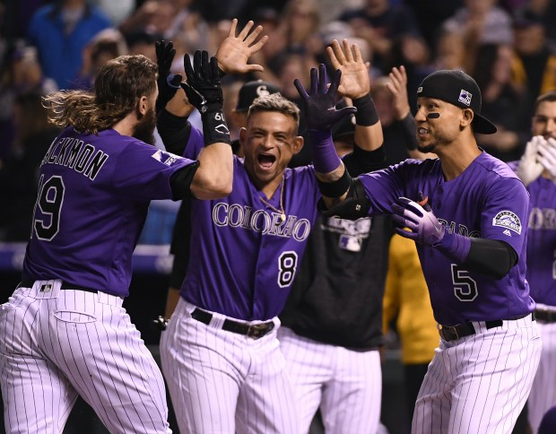

```{r Init, echo=FALSE, message=FALSE, warning=FALSE}
library(tidyverse)
library(readxl)
library(lubridate)
library(Lahman)
library(XML)
library(RCurl)
library(rlist)
library(knitr)
library(grid)
library(xtable)
library(flextable)
library(scales)
library(reshape2)
library(RColorBrewer)
library(kableExtra)

opts_chunk$set(echo=FALSE,
               cache=TRUE, autodep=TRUE, cache.comments=FALSE,
               message=FALSE, warning=FALSE)
HdrBg <- "lightsteelblue1"

source("../Baseball/Baseball_Functions.r")
```


```{r Headline,fig.cap = "Colorado Rockies win over Houston Astros!.",fig.width = 4}



```


> “Baseball is a man maker.” – Al Spalding

> "And Spalding is a baseball maker." ~ Jim Reed


# Colorado Rockies Statistics Snapshot

### NL West Standings

```{r FirstStats, results='asis', cap = "NL West Standings"}

# theurl <- getURL("https://www.baseball-reference.com/leagues/NL/2018-standings.shtml#expanded_standings_C::none")

theurl <- "https://www.baseball-reference.com/leagues/NL/2018-standings.shtml#expanded_standings_C::none"
doc <- getURL(theurl)
tables <- readHTMLTable(doc)
tables <- list.clean(tables, fun = is.null, recursive = FALSE)
n.rows <- unlist(lapply(tables, function(t) dim(t)[1]))

# knitr::kable(tables$standings_W, caption = "NL West Standings")

ft <- flextable(tables$standings_W, 
                col_keys = c("Tm", "W", "L", "WL.pct", "GB")) %>%
       theme_booktabs() %>%
       bg(bg = HdrBg, part = "header") %>%
       bg(i = ~ Tm == "Colorado Rockies", bg = "#EFEF99" ) %>%
       add_footer(Tm = "Close race in the NL West!") %>%
       merge_at(j = 1:5, part = "footer")
autofit(ft)
     

```


### Current Wins, Runs, Runs Against and Predicted Season Wins


```{r, cap = "Current Wins, Runs, Runs Against and Predicted Season Wins"}

Current <- getCurrentResults()
WINS <- Current$Wins
LOSSES <- Current$Losses
WPCT <- Current$Win.Pct
TotalR <- Current$Runs
TotalRA <- Current$Runs.Ag

Curr <- Current %>% rename(Pred.Season.Wins = starts_with("Predicted"))

ft2 <- flextable(Curr, col_keys = c("Wins", "Losses", "Win.Pct", "Runs","Runs.Ag", 
          "Pred.Season.Wins")) %>%
       theme_booktabs() %>%
       bg(bg = HdrBg, part = "header")

autofit(ft2)
```


\newpage


#  Colorado Rockies Weekly Newletter

```{r ,fig.height= 2.0}
knitr::include_graphics("images/Colorado-Rockies-Logo2.jpg")
```

## Week #17

* The Baseball Codes
* **Colorado Rockies Dashboard**
    + Rockies Win/Loss Graphs for 2018 and 2007
    + Top Twelve Rockies Players as Measured by WAR
    + National and American League Standings
    + Game-by-Game Results
    + **Pythagorean Theorem** prediction of the number of wins.
    + Batting Statistics (for non-pitchers)
    + Pitching Statistics
    + National League Team Standard Batting
    + Current Injuries **Updated**
    
The source data for this article can be found at URL [http://baseball-reference.com](http://baseball-reference.com).


\newpage

### The Baseball Codes

This Jason Turbow post was originally seen in 2011.  Sign Stealing?  The insteresting point in this article is the fact that statistics support the accusation.  The increase in home runs by the Bluie Jays increased dramtically in 2010. 


####  Accusations Against the Blue Jays Explode: Sign Stealing at the Rogers Centre?

> Posted on August 10, 2011 by Jason Turbow in Sign stealing, Toronto Blue Jays

Back in July, when Joe Girardi intimated that the Blue Jays might be employing some beyond-the-field methods of acquiring other teams’ signs at the Rogers Centre, people didn’t pay much attention.

When Hardball Talk suggested that the Red Sox felt similarly, based on the fact that catcher Jarrod Saltalamacchia was putting down complex signs for Clay Buchholz in Toronto, even with nobody on base, it made barely a ripple. Jorge Posada did something similar when the Yankees came to town, but still, not much was said.

Now that ESPN.com has given us more than 2,000 words on the topic, however, featuring an anonymous reliever threatening to hit Jose Bautista “in the fucking head” if the Blue Jays don’t knock off their sign stealing, eyes are starting to settle on happenings north of the border.

In the piece, by Amy Nelson, four unnamed relievers from the same team offered details: The guy doing the relaying was wearing a white shirt, for better visibility from the plate; he was positioned in the center field stands, just beyond the pitcher, to be easily seen by the batter without being detected; he put his arms over his head for any offering but a fastball; and he was stationed only 25 yards from the bullpen, which is how the relievers came to see him so clearly.

Some of the pitchers recalled seeing the guy doing something similar at the tail end of the 2009 season. They quickly called the dugout and had their catcher start mixing up his signs. An inning later the man in white departed.

Bautista confirmed the confrontation, but denied that A) it had been about sign stealing, and B) the Blue Jays do anything of the sort, highlighted by the phrase, “We do not cheat.” Later in the story, Blue Jays GM Alex Anthopoulos offers a similar denial.

So how to reconcile these viewpoints? The Blue Jays’ home record doesn’t reflect any improprieties—they’re 28-27 at home, 30-30 on the road—but other statistics appear to be damning. See the ESPN story for a full rundown, but here’s a smattering of examples:

* Toronto’s home run rate on contact at home last season was 5.4 percent, about 50 percent higher than on the road, yet their opponents hit fewer homers in Toronto than at a neutral ballpark.

* From 2005-09, the Rogers Centre saw .002 more home runs for every ball put in play than average. In 2010, that number shot up to .011—but only for the Blue Jays.

* In 2010, the Blue Jays had the highest isolated power (slugging percentage minus batting average) of any team since 1954—most of which came at home. (The 150 homers they hit in Toronto were three shy of the all-time home record set by the Rangers in 2005.)

* Seven Blue Jays regulars had an OPS at least 50 points higher at home than on the road; six of them were more than 100 points higher; three were 200 points higher.

This season, the Blue Jays have hit 71 homers at home and 57 on the road, despite having fewer than half their plate appearances at the Rogers Centre. They also have wide home/road splits for batting average (.261/.249), slugging percentage (.444/.389) and OPS (.770/.701). (All numbers are through Tuesday’s games.)

There’s also the case of Vernon Wells, as detailed by Hardball Talk. The slugger featured relatively equitable home-road OPS splits while playing for the Blue Jays—until last season, when he hit .991 at home, and .708 road. This number gathers momentum when combined with his .622 OPS this season with the Angels.

None of it, of course, is conclusive. Wells is in a new environment, has had his share of struggles as of late, and could simply be aging. The Blue Jays might simply be that much better at home than everybody else. For what it’s worth, J.P. Arencibia has denied everything, with some colorful language, on Twitter.

Ultimately, it comes down to this: Rare is the ballplayer or manager who sees sign stealing from the basepaths as anything more than an indication that it’s time to get better signs. When things move beyond the field of play, however, tempers can get testy, quickly.

(Wild home-road splits are a common indicator that something shady is going on. Though nothing was ever proved, the fact that the Rangers performed much better at home than on the road in recent years made them prime suspects around the American League.)

The Baseball Codes details the travails of pitcher Al Worthington, who in 1960 was traded to the White Sox—in part because he didn’t approve of the sign stealing done by his former team, the Giants. When he arrived in Chicago, however, he found an elaborate system in place in Comisky Park.

>When the team played at home, Chicago’s pitching instructor and former Tigers standout, Dizzy Trout, watched the opposing catcher from inside the recently installed Comiskey Park “exploding” scoreboard—a pyrotechnic exhibition unlike any seen in baseball up to that time. Trout then triggered a light hidden amid many others in the center-field display, that signaled hitters to the type of pitch about to be thrown—blinking meant breaking ball, solid meant fastball. It could be seen from both the plate and the White Sox dugout along the third-base line, but not from the visitors’ dugout near first. The scheme was incredibly effective, helping the Sox build a 51-26 record (.662) at home that year, even as they struggled to a 36-41 mark (.468) on the road.

Worthington complained to manager Al Lopez, who insisted that the system was morally acceptable. Said the pitcher: “I thought later, Well, if it’s okay to do it, why don’t they tell everyone?”

Toronto’s methods (if the allegations are true) are not nearly that complex, and aren’t even original. Former Tigers catcher Bill Freehan talked about similar situations during his own playing days:

>You’d have a buddy on Oakland, and he’d tell you hey, we’ve got a guy out there in the background, so we aren’t looking at the pitcher, we’re looking over his head and somebody’s putting his right hand up for a fastball. As a catcher—especially when your team’s getting lit up—you start to think, “Uh-oh, have they got them here?” There would be guys in the wall at Fenway, and sometimes you had to make changes every inning.

So: Fenway, Oakland, Texas, San Francisco, Chicago. In the 1940s the Indians pinched signs with a military-grade gun sight brought back from WWII by Bob Feller. The New York Giants did something similar during the fabled 1951 season of The Shot Heard ‘Round the World. (Visiting teams, for that matter, were known to steal signs from the center field clubhouses of the Polo Grounds.) The Cubs spent much of the 1960s signaling hitters from the Wrigley Field scoreboard.

It’s safe to say that this kind of thing happens more than outsiders (or even insiders) care to imagine. The one commonality between all these accusations: Once they’re caught, the allegedly guilty parties are expected to stop.

So even though the league office has yet to field a complaint about the Blue Jays, expect extra vigilance from visitors to the Rogers Centre and an almost certain disappearance of the man in the white shirt. Should anybody see something suspicious, things have now reached the point at which hitting somebody “in the fucking head” (or, more appropriately, in the fucking hip), is a real possibility.

**Update (8/11)**: Bautista says the team making accusations is the White Sox. (This was actually sussed out earlier by the Steal of Home blog, which not only fingered Chicago, but provided some screen caps of the possible man in white.)

**Updated 2 (8/11)**: In Toronto to face the Blue Jays, A’s reliever Grant Balfour told the San Francisco Chronicle that he was aware of the rumors about the man in the white shirt, but has seen no evidence to support it. “If you’re [stealing signs like that], you’re going to wear it,” he said. “That’s the way it goes. Be prepared to get worn out. Go ahead, but know that that’s the unwritten rule.”

– Jason


\newpage

# Rockies Dashboard
## Win Loss Margin

One of the many ways to visualize a teams performance is to show wins and losses as the margin of the win (positive) or loss (negative).  In the graphs below, we show the current season performance.  For emphasis, wins are displayed in green (above the zero) and losses in red (below).

Following the current season's graph, I have included the Win/Loss margin chart for our benchmark season of 2007 when the Rockies won the National League pennant.  

```{r GBG18}
GBG18 <- suppressWarnings(getRockiesGBG(2018))

# Calculate Cumulative Wins and Losses
GBG18 <- GBG18 %>%  
  mutate(WinG = ifelse( grepl('W',GBG18$'W/L'), 1, 0)) %>% 
  mutate(LossG = ifelse(grepl('L',GBG18$'W/L'),1,0))
GBG18 <- GBG18 %>% mutate(C.WinG = cumsum(WinG)) %>%
      mutate(C.LossG = cumsum(LossG)) %>%
      mutate(Date.Full = as.Date(paste(trimws(GBG18$Date), ", 2018", sep =""), 
                                 format ="%B %d, %Y"))
```

```{r WinLossMargin18,fig.height=3.5,fig.width=6.5}

# Produce Win/Loss Margin Plot

GBG18$Date <- trimws(GBG18$Date)
D <- tibble(Date = GBG18$Date, Year = 2018, WLMargin = GBG18$R - GBG18$RA, 
            DN = GBG18$`D/N`, HA = GBG18$`H/A`, WLsign = " ")
D <- D %>% separate(Date, into = c("Month", "Day"), sep =" ")

D$WLsign <-  ifelse(D$WLMargin < 0, "Loss", "Win")


D$Month <- match(tolower(D$Month), tolower(month.abb))
D$Date <- with(D, as.Date(paste(Year, Month, Day, sep = "/")))

p1 <- ggplot(D, aes(x = Date, y = WLMargin, fill = WLsign)) + 
  geom_bar(stat = "identity", position = position_dodge(width=0.8)) + 
  guides(fill=FALSE) +
  scale_fill_manual(values= c("Win" = "green3", "Loss" = "red")) +
  scale_x_date(date_breaks = "1 month", date_minor_breaks = "1 week", date_labels = "%B") +
  ggtitle("Rockies 2018 Win/Loss Margin") + xlab("Game Date") + ylab("Game Margin (runs)")

```


```{r GBG07}
GBG07 <- suppressWarnings(getRockiesGBG(2007))

# Calculate Cumulative Wins and Losses
GBG07 <- GBG07 %>%  
  mutate(WinG = ifelse( grepl('W',GBG07$'W/L'), 1, 0)) %>% 
  mutate(LossG = ifelse(grepl('L',GBG07$'W/L'),1,0))
GBG07 <- GBG07 %>% mutate(C.WinG = cumsum(WinG)) %>%
      mutate(C.LossG = cumsum(LossG)) %>%
      mutate(Date.Full = as.Date(paste(trimws(GBG07$Date), ", 2017", sep =""), 
                                 format ="%B %d, %Y"))
```

```{r WinLossMargin07,fig.height=3.5, fig.width=6.5}

# Produce Win/Loss Margin Plot

GBG07$Date <- trimws(GBG07$Date)
D <- tibble(Date = GBG07$Date, Year = 2007, WLMargin = GBG07$R - GBG07$RA, 
            DN = GBG07$`D/N`, HA = GBG07$`H/A`)
D <- D %>% separate(Date, into = c("Month", "Day"), sep =" ")
D$WLsign = ifelse(D$WLMargin < 0, "Loss", "Win")

D$Month <- match(tolower(D$Month), tolower(month.abb))
D$Date <- with(D, as.Date(paste(Year, Month, Day, sep = "/")))

p2 <- ggplot(D, aes(x = Date, y = WLMargin, fill = WLsign)) + 
  geom_bar(stat = "identity", position = position_dodge(width=0.8)) + 
  guides(fill=FALSE) +
  scale_fill_manual(values= c("Win" = "green3", "Loss" = "red")) +
  scale_x_date(date_breaks = "1 month", date_minor_breaks = "1 week", date_labels = "%B") +
  ggtitle("Rockies 2007 Win/Loss Margin") + xlab("Game Date") + ylab("Game Margin (runs)")

p1
p2
```


\newpage

### Top Twelve Rockies Players as Measured by WAR

```{r Top12Rockies, cap = "Top Twelve Rockies as Measured by WAR"}

defSalary <- 545000  
# Get latest Batting and Pitching WAR Data
if(!exists("batWar")) {batWar <- getDailyBatWar()}
if(!exists("pitWar")) {pitWar <- getDailyPitWar()}

# Add WAR Field to roster
url <- 
  "https://www.baseball-reference.com/teams/COL/2018-roster.shtml#appearances::none"
doc <- getURL(url)
cClasses <- c("character", "integer",   "character", "character", "character",
              "character", "integer",   "character", "integer",   "integer",
              "integer",   "integer",   "integer",   "integer",   "integer",
              "integer",   "integer",   "integer",   "integer",   "integer",
              "integer",   "integer",   "integer",   "integer",   "integer",
              "integer",   "double",   "character",    "character")
tables <- suppressWarnings(readHTMLTable(doc, header = TRUE, 
              stringsAsFactors = FALSE, colClasses = cClasses))

roster <- tables[[2]]
tnames <- names(roster)
tnames[3] <- "Nat"
tnames[28] <- "Note"
tnames[29] <- "empty"
colnames(roster) <- tnames
roster <- as_tibble(roster) 


# Salary data not yet populated in baseball-reference roster data
# # Cleanup Salary field
# roster$Salary <- suppressWarnings(sapply(roster$Salary, 
#                     function(xx) as.numeric(gsub('[^0-9]', '', xx))))
# roster$Salary[is.na(roster$Salary)] <- defSalary

# Separate top players by WAR
top12 <- head(arrange(roster,desc(WAR)),n = 12) ## %>% mutate(Salary.M = Salary/1e6)
top12$Rank <- 1:12

#knitr::kable(top12[,c(29,1,2,27)], cap = "Rockies Top 12 Players (WAR)")

ftop <- flextable(select(top12,"Rank","Name", "Age", "WAR"), 
                  col_keys = c("Rank","Name", "Age", "WAR")) %>%
       theme_booktabs() %>%
       bg(bg = HdrBg, part = "header")

autofit(ftop)

```

\newpage

## [National League Standings](http://www.baseball-reference.com/leagues/NL/2017-standings.shtml#expanded_standings_W::none)


```{r NLStandings2, results='asis'}
theurl <- getURL("https://www.baseball-reference.com/leagues/NL/2018-standings.shtml#expanded_standings_W::none")
tables <- readHTMLTable(theurl)
tables <- list.clean(tables, fun = is.null, recursive = FALSE)
n.rows <- unlist(lapply(tables, function(t) dim(t)[1]))
```

#### NL East Standings

```{r, cap = "National League East Standings"}
nlE <- flextable(tables$standings_E, 
                  col_keys = c("Tm", "W", "L", "WL.Pct", "GB")) %>%
       theme_booktabs() %>%
       bg(bg = HdrBg, part = "header")

autofit(nlE)
```

#### NL Central Standings

```{r, cap = "National League Central Standings"}
nlC <- flextable(tables$standings_C, 
                  col_keys = c("Tm", "W", "L", "WL.Pct", "GB")) %>%
       theme_booktabs() %>%
       bg(bg = HdrBg, part = "header")

autofit(nlC)
```


#### NL West Standings

```{r, cap = "National League West Standings"}
nlW <- flextable(tables$standings_W, 
                  col_keys = c("Tm", "W", "L", "WL.Pct", "GB")) %>%
       theme_booktabs() %>%
       bg(bg = HdrBg, part = "header")

autofit(nlW)
```


\newpage

## [American League Standings](http://www.baseball-reference.com/leagues/AL/2017-standings.shtml#expanded_standings_W::none)

```{r ALStandings, results = 'asis'}

ALurl <- getURL("https://www.baseball-reference.com/leagues/AL/2018-standings.shtml#expanded_standings_W::none")
ALStandings <- readHTMLTable(ALurl)
ALStandings <- list.clean(ALStandings, fun = is.null, recursive = FALSE)
n.rows <- unlist(lapply(ALStandings, function(t) dim(t)[1]))
```


#### AL East Standings

```{r, cap = "American League East Standings"}
alE <- flextable(ALStandings$standings_E, 
                  col_keys = c("Tm", "W", "L", "WL.Pct", "GB")) %>%
       theme_booktabs() %>%
       bg(bg = HdrBg, part = "header")

autofit(alE)
```

#### AL Central Standings

```{r, cap = "American League Central Standings"}
alC <- flextable(ALStandings$standings_C, 
                  col_keys = c("Tm", "W", "L", "WL.Pct", "GB")) %>%
       theme_booktabs() %>%
       bg(bg = HdrBg, part = "header")

autofit(alC)
```


#### NL West Standings

```{r, cap = "American League West Standings"}
alW <- flextable(ALStandings$standings_W, 
                  col_keys = c("Tm", "W", "L", "WL.Pct", "GB")) %>%
       theme_booktabs() %>%
       bg(bg = HdrBg, part = "header")

autofit(alW)
```


\newpage

## Rockies Game-by-Game Schedule/Results

```{r GBGResults, results = 'asis', cap = "Rockies Game-by-Game Schedule/Results" }
GBG18 <- getRockiesGBG(2018) 
GBG18 <- filter(GBG18, Win != " ") %>%
  filter(Win != "Win")
#knitr::kable(GBG18)
GBG18 <- GBG18 %>% rename(Gm.Num = `Gm#`, HA = "H/A", WL = "W/L", DN = "D/N") %>% select(-14)
gbg <- flextable(GBG18, 
                  col_keys = c("Gm.Num", "Day", "Date", "HA", "Opp", "WL", "R", "RA", 
                               "Win", "Loss", "Save", "DN", "Streak")) %>%
       theme_booktabs() %>%
       bg(bg = HdrBg, part = "header")

autofit(gbg)
```


The Rockies current record is `r Current$Wins` Wins and `r Current$Losses` Losses.  So far, the Rockies have scored `r TotalR` runs and have had `r TotalRA` runs scored against them.

\newpage

## Pythagorean Win-Loss Theorem
$$ predicted W\% = \frac{R^k}{R^k+RA^k}   $$
```{r PredWin, echo=FALSE, message=FALSE, warning=FALSE, results='asis'}
# Build Table of Pythagorean Win Predictions for 2018
PredictedWins <- tibble(
  W181   = round(TotalR^1.81/(TotalR^1.81+TotalRA^1.81)*162),
  W183   = round(TotalR^1.83/(TotalR^1.83+TotalRA^1.83)*162),
  W200   = round(TotalR^2.00/(TotalR^2.00+TotalRA^2.00)*162))
```

Using the commonly used values of k, the Rockies predicted wins for the 2017 are shown in the table below.  Remember this statistic will vary widely over the course of the season.

```{r PredWins, echo=FALSE, message=FALSE, warning=FALSE, results='asis', cap = "Pythagorean Win Results"}

pred <- flextable( data = PredictedWins, col_keys = c("W181", "W183", "W200") ) %>%
 add_header(W181 = "Wins (k =1.81)", W183 = "Wins (k=1.83)", W200 = "Wins (k=2.0)") %>%
       theme_booktabs() %>% 
       bg(bg = HdrBg, part = "header")
          
autofit(pred)
```

\newpage

## Batting Statistics (non-pitchers)

#### Batting Statistics (1 of 2)

```{r, echo=FALSE, message=FALSE, warning=FALSE, results= 'asis', cap = "Batting Statistics (1 of 2)"}

burl <- 
  getURL("https://www.baseball-reference.com/teams/COL/2018.shtml#team_batting::none")

  TeamStats <- readHTMLTable(burl)
  TeamStats <- list.clean(TeamStats, fun = is.null, recursive = FALSE)
  TeamBatting <- as_tibble(TeamStats$team_batting) %>%
       separate(Name, into = c("First", "Name"), sep =" ")
  
#
# ---------------------------------->>  Rockies Batting Statistics (1 of 2)  
#  
  TEAMB <- TeamBatting %>% 
  select(c(1,2,4,5,6,8,9,10,11,12,13, 14, 15, 16, 17)) %>%   
  filter(Rk != "Rk" & Pos != "P") %>%
    rename("TwoB" = "2B", "ThreeB" = "3B")

ftTeamB <- flextable( data = TEAMB, col_keys = c(names(TEAMB)) ) %>%
       theme_booktabs() %>% 
       bg(bg = HdrBg, part = "header")
          
autofit(ftTeamB)
```

#### Batting Statistics (2 of 2)

```{r, cap = "Batting Statistics (2 of 2)"}

#
# ---------------------------------->>  Rockies Batting Statistics (2 of 2)
#
TEAMB2 <- TeamBatting %>% 
  select(c(1,2,4,5,18,19,20,21,22,23:29)) %>%   
  filter(Rk != "Rk" & Pos != "P") %>%
  rename("OPSplus" = "OPS+")

ftTeamB2 <- flextable( data = TEAMB2, col_keys = c(names(TEAMB2)) ) %>%
       theme_booktabs() %>% 
       bg(bg = HdrBg, part = "header")

autofit(ftTeamB2)
```

* \* - bats left-handed, # - bats both, else - bats right, ? - unknown; OPS_lg for OPS+ does not include pitchers.

\newpage

## Pitching Statistics

#### Rockies Pitching Statistics (1 of 2)

```{r, echo=FALSE, message=FALSE, warning=FALSE, results='asis', cap = "Pitching Statistics (1 of 2)"}

PitchUrl <- 
  getURL("http://www.baseball-reference.com/teams/COL/2018.shtml#team_pitching::none")

  PitchStats <- readHTMLTable(PitchUrl)
  PitchStats <- list.clean(PitchStats, fun = is.null, recursive = FALSE)
 
#
# ----------------------------------->> Rockies pitching statistics (1 of 2).
#
TeamPitching <- as_tibble(TeamStats$team_pitching) %>%
       separate(Name, into = c("First", "Name"), sep =" ")

TEAMP <- TeamPitching %>%   
  filter(Rk != "Rk") %>%
  select(c(1,2, 4, 5:18)) %>%
  rename("WLpct" = "W-L%")
  
ftTeamP <- flextable( data = TEAMP, col_keys = c(names(TEAMP)) ) %>%
       theme_booktabs() %>% 
       bg(bg = HdrBg, part = "header")
          
autofit(ftTeamP)
```

#### Rockies Pitching Statistics (2 of 2)

```{r, cap = "Pitching Statistics (2 of 2)"}
  
#
# ----------------------------------->> Rockies pitching statistics (2 of 2).
#
TEAMP2 <- TeamPitching %>%
  filter(Rk != "Rk")  %>%
  select(c(1,2, 4, 19:30)) %>%
  rename("ERAplus" = "ERA+")

ftTeamP2 <- flextable( data = TEAMP2, col_keys = c(names(TEAMP2)) ) %>%
       theme_booktabs() %>% 
       bg(bg = HdrBg, part = "header")
          
autofit(ftTeamP2)

```

  \* - throws left-handed

\newpage

#### National League Team Standard Batting (1 of 2)

```{r,cap = "NL Team Batting statistics (1 of 2)."}
NLTeamBatUrl <- 
  getURL("https://www.baseball-reference.com/leagues/NL/2018.shtml#teams_standard_batting::3")

C.Classes <- c("character", "integer", rep("double",2), rep("integer",13), 
               rep("double",4), rep("integer",8))

BatStats <- readHTMLTable(NLTeamBatUrl,stringsAsFactors = FALSE, colClasses = C.Classes)
BatStats <- list.clean(BatStats, fun = is.null, recursive = FALSE)
NLBatStats <- as_tibble(BatStats$teams_standard_batting, as.factor = FALSE)
  
TEAMB <- NLBatStats %>% 
  arrange(desc(NLBatStats$'R/G')) %>%  
  select(c(1:4, 5:17)) %>%
  rename("NumBat" = "#Bat", "RperG"= "R/G", "TwoB" = "2B", "ThreeB" = "3B")

ftTeamB <- flextable( data = TEAMB, col_keys = c(names(TEAMB)) ) %>%
       theme_booktabs() %>% 
       bg(bg = HdrBg, part = "header")
          
autofit(ftTeamB)

```


#### National League Team Standard Batting (2 of 2)

```{r, cap = "NL Team Batting statistics (2 of 2)."}

#knitr::kable(TEAMB, caption = "NL Team Batting statistics (1 of 2).")

TEAMB2 <- NLBatStats %>% 
  arrange(desc(NLBatStats$'R/G')) %>%  
  select(c(1:4, 18:29)) %>%
  rename("NumBat" = "#Bat", "RperG"= "R/G", "OPSplus" = "OPS+")

ftTeamB2 <- flextable( data = TEAMB2, col_keys = c(names(TEAMB2)) ) %>%
       theme_booktabs() %>% 
       bg(bg = HdrBg, part = "header")
          
autofit(ftTeamB2)


#knitr::kable(TEAMB, caption = "NL Team Batting statistics (2 of 2).")


```


\newpage

#### Current Injuries

```{r, echo=FALSE, message=FALSE, warning=FALSE, results= 'asis', cap ="Current Player Injuries"}
injUrl <- "https://www.baseball-reference.com/teams/COL/2018.shtml#all_injuries"
injUrl <- "http://www.rotoworld.com/teams/injuries/mlb/col/"
injDoc <- getURL(injUrl)
Tables <- readHTMLTable(injDoc)
## Temporary Code to Display Injury Report until I figure out how 
## to use the URL provided
## Baseball-Reference.com (above).
## Injuries <- read_excel("./data/Rockies_Injuries.xlsx")

Injuries <- Tables[[3]]
names(Injuries)[2] <- "Details"
Injuries <- as_tibble(Injuries)  
# Injuries <- select(Injuries,c(1,3,4,5)) 
# Injuries <-  rename(Injuries, Updated = Last.Updated, 
#                     Type = Injury.Type, Details = Injury.Details)
  
  injuryRep <- flextable( data = Injuries, col_keys = c(names(Injuries)) ) %>%
       theme_booktabs() %>% 
       bg(bg = HdrBg, part = "header")
          
autofit(injuryRep)

```

Run date time: `r Sys.time()`